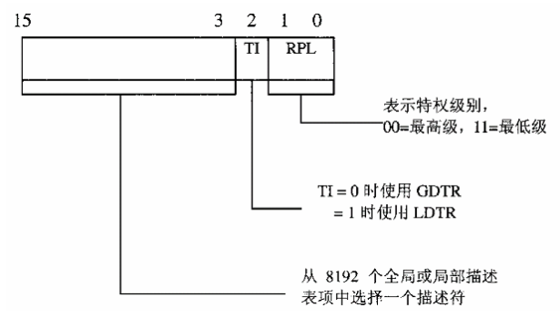
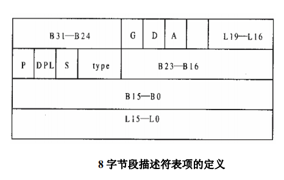
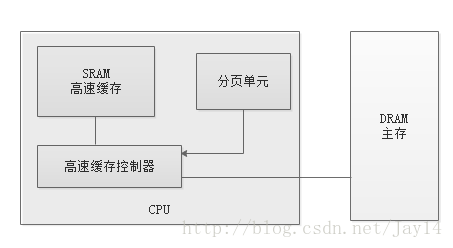
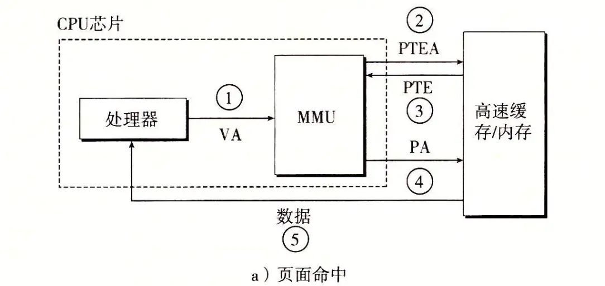
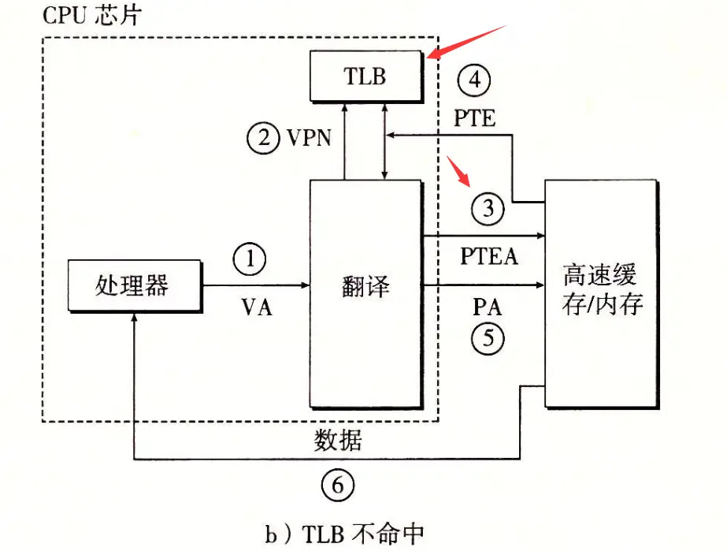

## 内存寻址（深入理解LINUX内核）

### 内存地址

我们偶尔会引用内存地址作为访问内存单元内容的一种方式，但是，当使用 80x86 微处理器时，我们必须区分以下三种不同的地址：

#### **逻辑地址（logical address）**

包含在机器语言指令中用来**规定一个操作数或一条指令的地址**。

每个逻辑地址都由一个段（segment）和偏移量（offset或displacement）组成，偏移量指明了从段开始的地方到实际地址之间的距离。

#### **线性地址（linear address）**

线性地址也称为**虚拟地址**（virtual address）。

线性地址是一个32位无符号整数，可以用来表示高达4GB的地址，也就是，高达4294967296个内存单元。线性地址通常用十六进制数字表示，值的范围从0x00000000到0xffffffff。

#### **物理地址（physical address）**

用于内存芯片级内存单元寻址。它们与从微处理器的地址引脚发送到内存总线上的电信号相对应。物理地址由32位或36位无符号整数表示。

#### 地址转换

内存控制单元（MMU）通过**分段单元把一个逻辑地址转换成线性地址**；

然后，第二个**分页单元把线性地址转换成一个物理地址**。

### 分段单元

分段单元**把逻辑地址转换成线性地址**。

#### 段选择符和段寄存器

逻辑地址由两部分组成：**一个段标识符和一个指定段内相对地址的偏移量**。**段选择符并不直接指向段,而是指向段描述符表中定义段的段描述符。**

段标识符是一个16 位长的字段，称为段选择符（Segment Selector），而偏移量是一个32 位长的字段。

为了快速方便地找到段选择符，处理器提供段寄存器，**段寄存器的唯一目的是存放段选择符**。这些段寄存器称为cs、ss、ds、es、fs 和gs。尽管只有 6 个段寄存器，但程序可以把同一个段寄存器用于不同的目的，方法是先将其值保存在内存中，用完后再恢复。

6 个寄存器中 3 个有专门的用途：

- cs 代码段寄存器，指向包含程序指令的段。
- ss 栈段寄存器，指向包含当前程序栈的段。
- ds 数据段寄存器，指向包含静态数据或者全局数据段。

其他3 个段寄存器作一般用途，可以指向任意的数据段。

cs 寄存器还有一个很重要的功能：它含有一个两位的字段，用以指明CPU 的当前特权级（Current Privilege Level，CPL）。值为 0 代表最高优先级，而值为 3 代表最低优先级。Linux 只用 0 级和 3 级，分别称之为内核态和用户态。

#### 段描述符（Segment Descriptor）

**每个段由一个 8 字节的段描述符表示**，它描述了段的特征。**段描述符放在全局描述符表**（Global Descriptor Table ,GDT）**或局部描述符表**（Local Descriptor Table, LDT）中。

80386 **CPU中增设了两个寄存器**：一个是全局性的段描述表寄存器GDTR，另一个是局部性的段描述表寄存器LDTR，**分别可以用来指向存储在内存中的一个段描述结构数组，或者称为段描述表**。由于这两个寄存器是新增设的，不存在与原有的指令是否兼容的问题，访问这两个寄存器的专用指令便设计成“特权指令”。

在此基础上，段寄存器的高13位（低3位另作它用）用作访问段描述表中具体结构的下标(index)，如下图所示：

**通常只定义一个GDT**，而**每个进程**除了存放在GDT 中的段之外如果还需要创建附加的段，就**可以有自己的LDT**。GDT在主存中的地址和大小存放在GDTR控制寄存器中，当前正被使用的LDT 地址和大小放在LDTR控制寄存器中。

GDTR或LDTR中的段描述表指针和段寄存器中给出的下标结合在一起，才决定了具体的段描述表项在内存中的什么地方，也可以理解成，**将段寄存器内容的低3位屏蔽掉（里面是段表述表寄存器选择和特权级别设置）后与GDTR或LDTR中的基地址相加得到描述表项的起始地址。**

因此就无法通过修改描述表项的内容来玩弄诡计，从而起到保护的作用。每个段描述表项的大小是8个字节，**每个描述表项含有段的基地址和段的大小**，再加上其它一些信息，其结构如下图所示。

结构中的 B31 ~ B24 和 B23 ~ B16分别为**基地址**的 bit16 ~ bit23 和 bit24 ~ bit31，

L19 ~ L16和L15 ~ L0则为**段长度**的 bit10 ~ bit15 和 bit16 ~ bit19

#### 逻辑地址->线性地址

分段单元（segmentationunit）执行以下操作：

1. **先检查段选择符的TI字段，以决定段描述符保存在哪一个描述符表中。**TI字段指明描述符是在GDT 中（在这种情况下，分段单元从GDTR寄存器中得到GDT的线性基地址）还是在激活的LDT中（在这种情况下，分段单元从LDTR寄存器中得到LDT 的线性基地址）。
2. **从段选择符的 index 索引字段计算段描述符的地址**，index 字段的值乘以8（一个段描述符的大小，左移3位，从13位转为16位），**这个结果与GDTR或LDTR寄存器中的内容相加**。
3. **把逻辑地址的偏移量与段描述符的Base 字段的值**相加就得到了线性地址。

### 分页单位

**分页单元把线性地址转换成物理地址。** 其中的一个关键任务是**把所请求的访问类型与线性地址的访问权限相比**较，如果这次内存访问是无效的，就**产生一个缺页异常**。

为了效率起见，**线性地址被分成以固定长度为单位的组，称为页**（page）。**页内部连续的线性地址被映射到连续的物理地址中。**这样，内核可以指定一个页的物理地址和其存取权限，而不用指定页所包含的全部线性地址的存取权限。我们遵循通常习惯，使用术语“页”既指一组线性地址，又指包含在这组地址中的数据。

**分页单元把所有的RAM 分成固定长度的页框**（有时叫做物理页）。每一个页框包含一个页，也就是说**一个页框的长度与一个页的长度一致。**页框是主存的一部分，因此也是一个存储区域。区分一页和一个页框是很重要的，前者只是一个数据块，可以存放在任何页框或磁盘中。每个页（虚拟地址）和页框（物理地址）大小为4KB。

把线性地址映射到物理地址的数据结构称为页表（page table）。**页表存放在主存中，并在启用分页单元之前必须由内核对页表进行适当的初始化。**MMU以页为单位管理系统的页表，也是最小单位。

#### 线性地址->物理地址

从80386 起，**Intel 处理器的分页单元处理4KB 的页。**

32 位的线性地址被分成 3 个域：

- **Directory**（目录）：最高10 位
- **Table**（页表）：中间10 位
- **Offset**（偏移量）：最低12 位

**线性地址的转换分两步完成，每一步都基于一种转换表，第一种转换表称为页目录表，第二种转换表称为页表**。

使用这种**二级模式的目的在于减少每个进程页表所需RAM的数量**。如果使用简单的一级页表，那将需要高达220个表项（在每项 4 个字节时，需要 4MB RAM）来表示**每个**进程的页表（如果进程使用全部4GB线性地址空间），即使一个进程并不使用那个范围内的所有地址。**二级模式通过只为进程实际使用的那些虚拟内存区请求页表来减少内存容量。**

**每个活动进程必须有一个分配给它的页目录。**不过，没有必要马上为进程的所有页表都分配RAM。**只有在进程实际需要一个页表时才给该页表分配RAM会更为有效率。**

**正在使用的页目录的物理地址存放在控制寄存器 cr3 中。**线性地址内的Directory 字段决定页目录中的目录项，而目录项指向适当的页表。地址的Table 字段依次又决定页表中的表项，而**表项含有页所在页框的物理地址**。

Offset 字段决定页框内的相对位置。由于**它是12 位长，故每一页含有4096 字节的数据**。

Directory 字段和 Table 字段都是10 位长，因此页目录和页表都可以多达1024 项。那么**一个页目录可以寻址到高达1024×1024×4096=232个存储单元**，这和我们对32 位地址所期望的一样。

#### 举例

这个简单的例子将有助于阐明常规分页是如何工作的。

我们假定内核已给一个正在运行的进程分配的线性地址空间范围是 0x20000000 到 0x2003ffff。

这个空间正好由64页组成。我们不必关心包含这些页的页框的物理地址，事实上，其中的一些页甚至可能不在主存中。我们只关注页表项中剩余的字段。

让我们从分配给进程的线性地址的最高10 位（分页单元解释为Directory 字段）开始。这两个地址都以 2 开头后面跟着0，因此高10 位有相同的值，即0x080 或十进制的128。因此，这两个地址的Directory 字段都指向进程页目录的第129项。相应的目录项中必须包含分配给该进程的页表的物理地址。

如果没有给这个进程分配其它的线性地址，则页目录的其余 1023 项都填为0。

中间 10 位的值（即Table 字段的值）范围从0 到 0x03f，或十进制的从 0 到 63。因而只有页表的前 64 个表项是有意义的，其余 960 个表项都填0。

假设进程需要读线性地址 0x20021406 中的字节。这个地址由分页单元按下面的方法处理:

1. Directory 字段的 0x80 （0010,0000,00->00/1000/0000）用于选择页目录的第 0x80 目录项, 此目录项指向和该进程的页相关的页表。
2. Table 字段 0x21 用于选择页表的第 0x21 表项, 此表项指向包含所需页的页框。
3. 最后，Offet 字段0x406 用于在目标页框中读偏移量为0x406 中的字节。

**如果页表第0x21 表项的Present 标志为0，则此页就不在主存中；在这种情况下，分页单元在线性地址转换的同时产生一个缺页异常。**

无论何时，当进程试图访问限定在0x20000000 到0x2003ffff 范围之外的线性地址时，都将产生一个缺页异常，因为这些页表项都填充了0，尤其是它们的Present 标志都被清0。

因为这时该页并没有在内存中，因此必须从磁盘请求。一次缺页便是一个**中断(trap)**。**当发生缺页时，内核必须选择一个页框，然后将其内容(页)写回到磁盘，从而用程序刚刚请求的页的内容来填充它。**

#### 缺页

1. DRAM缓存不命中成为缺页，
2. 当访问内存时，虚拟地址转换到物理地址时，发现对应的虚拟地址不在页表中，发送缺页异常，
3. 然后缺页异常处理程序会选择一个牺牲页，复制回磁盘，然后将所缺的页拷贝至牺牲页框，
4. 随后缺页异常处理程序返回，重新启动导致缺页的指令。

#### 高速缓存（CSAPP）

DRAM比SRAM慢10倍，磁盘比DRAM慢10w倍。

为了缩小CPU与RAM之间的速度不匹配，基于局部性原理，引入了硬件高速缓存机制，减少对主存的访问量。

高速缓存单元插在分页单元和主内存之间，由高速缓存控制器和高速缓存组成。

高速缓存内存存放内存中真正的行。高速缓存控制器存放一个表项数组，每个表项对应高速缓存内存中的一个行。

**高速缓存每个行内存储着主存中的一个行，当MMU得到物理地址后，试图对DRAM访问，会先查看是否命中高速缓存。**

1. 处理器生成虚拟地址传送给MMU
2. MMU生成PTE地址，并从主存或高速缓存请求，(去访问的是页表条目)
3. 高速缓存或主存（查找页表条目）以后返回一项给MMU
4. MMU根据返回的PTE（此时若命中PTE的有效位为1，否则触发异常)构造物理地址，再次发送给高速缓存/主存
5. 高速缓存/主存将请求的数据发送给CPU

#### TLB

如我们看到，每次CPU产生一个虚拟地址，MMU都必须查阅一个PTE（页表），然后将虚拟地址转为物理地址。这回导致**MMU多次请求主存**，过于浪费，因为**设置了后援缓存器(TLB)**，用于**加快线性地址的转换**。

当地址第一次被使用时，通过慢速访问DRAM中的页表计算出相应的物理地址，同时这个地址将放到一个TLB表项中。

然后查询时将上面的第2部该为：MMU使用虚拟地址去查找TLB，如果没查找到，再生成PTE从主存或高速缓存请求，返回的同时更新TLB。

##### 进程切换时的TLB

当系统发生进程切换，从进程A切换到进程B，从而导致地址空间也从A切换到B，这时候，我们可以认为在A进程执行过程中，所有TLB和Cache的数据都是for A进程的，一旦切换到B，整个地址空间都不一样了，因此需要全部flush掉，这也是进程切换比线程切换产生更大开销的主要原因——缓存失效！

#### 总结流程

1. 处理器生成虚拟地址传送给MMU
2. MMU使用虚拟地址去查找TLB，如果没查找到，再生成PTE从主存或高速缓存请求，返回的同时更新TLB。
3. 高速缓存或主存（查找页表条目）以后返回一项给MMU
4. MMU根据返回的PTE（**此时若命中PTE的有效位为1，否则不命中触发异常** )构造物理地址，若发现对应的虚拟地址不在页表中，发送缺页异常，然后**缺页异常处理程序会选择一个牺牲页，复制回磁盘，然后将所缺的页拷贝至牺牲页框**，随后缺页异常处理程序返回，重新执行4。
5. 根据构造的物理地址再次发送给高速缓存/主存
6. 高速缓存/主存将请求的数据发送给CPU

