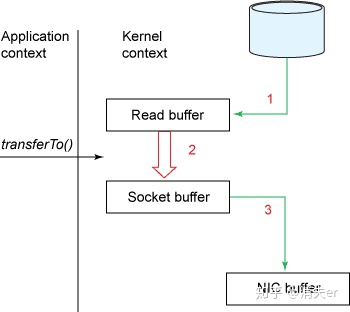

# MySQL

## MySQL的并发问题

多个事务**同时访问**数据库中**相同的数据**时，不同的隔离机制会导致不同的结构。若不采取必要的隔离机制，会出现各种并发问题。

**1. 賍读**

指一个线程中的事务读取到了另外一个线程中未提交的数据。

例如：对于两个事务T1和T2，T1读取了已经被T2更新但还**没有被提交**的字段后，如果T2回滚，T1读取的内容就是临时且无效的。

**2.不可重复读**

不可重复读是指在**同一个事务中**,**两次(或以上)查询**发现符合条件的**数据记录**的字段值**不相同****,也就是说**本事务可以读到其他事务commit后的数据**，导致不可重复读出现的原因主要是update/insert操作

例如：对于两个事务T1和T2， T1读取了一个字段，然后T2**更新**了该字段之后，T1再次读取同一个字段，值就不同了，或者可以读到更多的数据

**解决方式为添加行锁**

**3.幻读**

幻读指同一个事务中**,**两次(或以上)查询**发现符合条件的**数据记录**的数量**不相同

<https://segmentfault.com/a/1190000016566788?utm_source=tag-newest>

**解决幻读需要锁整张表**

RR隔离级别下

快照读的幻读-mvcc 解决
当前读的幻读-gap 锁（next-key）解决

## 隔离级别

数据库系统必须具有隔离并发运行各个事务的能力，使他们不会相互影响，避免各种并发问题。

**一个事务与其他事务隔离的程度称为隔离级别。**不同隔离级别对应不同的干扰程度，隔离级别越高，数据一致性越好，但并发性越弱。

| 隔离级别         | 賍读 | 不可重复读 | 幻读 |
| ---------------- | ---- | ---------- | ---- |
| read uncommitted | √    | √          | √    |
| read committed   | ×    | √          | √    |
| repeatable read  | ×    | ×          | √    |
| serializable     | ×    | ×          | ×    |

**READ UNCOMMITTED 读未提交数据**

允许事务读取未被其他事务提交的变更

賍读、不可重复读和幻读问题都会出现


**READ COMMITED 读已提交数据**

解决脏读

只允许事务读取**已经被其他事务提交**的变更

可以避免賍读，但不能避免不可重复读和幻读


**REPEATABLE READ 可重复读**

解决读未提交

确保事务可以多次从一个字段中读取相同的值，在这个事务持续期间，禁止其他事务对**这个字段**进行**更新**。

**（理论上是对字段加锁，实际通过MVCC使用版本号大大简化）**

可以避免賍读和不可重复读，但幻读已然存在


**SERIALIZABLE 串行化**

解决幻读

确保事务可以从一个表中读取相同的行，在这个事务持续期间，禁止其他事务对这个**表**进行插入、删除或更新。

***（对表加锁）***

所有的并发问题都可以避免，但性能十分低下。

## 幻读怎么解决

快照读的幻读-mvcc 解决
当前读的幻读-gap 锁（next-key）解决

<https://blog.csdn.net/sanyuesan0000/article/details/90235335>


## MVCC

当多个用户/进程/线程同时对数据库进行操作时，会出现3种冲突情形：

1. 读-读，不存在任何问题
2. 读-写，有隔离性问题，可能遇到脏读（会读到未提交的数据） ，幻影读等。
3. 写-写，可能丢失更新

要解决冲突，一种办法是是锁，即基于锁的并发控制，比如2PL，这种方式开销比较高，而且无法避免死锁。

多版本并发控制（MVCC）是一种用来**解决读-写冲突**的无锁并发控制，也就是为事务分配单向增长的时间戳，为每个修改保存一个版本，版本与事务时间戳关联，**读操作只读该事务开始前的数据库的快照**。 这样在读操作不用阻塞写操作，写操作不用阻塞读操作的同时，避免了脏读和不可重复读

作者：用心阁

链接：https://www.zhihu.com/question/27876575/answer/71836010

来源：知乎

著作权归作者所有。商业转载请联系作者获得授权，非商业转载请注明出处。

<https://blog.csdn.net/SnailMann/article/details/94724197>

<https://blog.csdn.net/sanyuesan0000/article/details/90235335>

## MySQL的锁，悲观锁和乐观锁的区别以及用法


## 索引数据结构、原因


## 主键索引 非主键索引


## 最左匹配


## 什么时候需要建立索引？什么时候不需要建立索引？


## 索引执行过程


## 数据库查询突然变慢，可能的原因


## 主键选择


# Redis

## 数据预热

缓存预热就是系统启动前,提前将相关的缓存数据直接加载到缓存系统。避免在用户请求的时候,先查询数据库,然后再将数据缓存的问题!用户直接查询实现被预热的缓存数据!

**前置准备工作:**
 1.日常例行统计数据访问记录,统计访问频度较高的热点数据
 2.利用LRU数据删除策略,构建数据留存队列
 **准备工作:**
 3.将统计结果中的数据分类,根据级别,redis优先加载级别较高的热点数据
 4.利用分布式多服务器同时进行数据读取,提速数据加载过程
 **实施:**
 1.使用脚本程序固定出发数据预热过程
 2.如果条件允许,使用了CDN(内容分发网络),效果会更好

## 热Key

## 分布式锁

```java
	/**
     * 尝试获取分布式锁
     * @param jedis Redis客户端
     * @param lockKey 锁
     * @param requestId 客户端标识
     * @param expireTime 超期时间
     * @return 是否获取成功
     */
//通过requestId解决了分布式下不同客户端时间不统一问题，
//通过超期时间解决了死锁问题
//通过解锁时判断requestId解决了任何客户端都可以解锁问题。

    bool tryLock(Redis client, String lockKey, String requestId, int expireTime) {
        String result = client.set(lockKey, requestId, NX, PX, expireTime);        
        if (LOCK_SUCCESS.equals(result)) {            
            return true;
        }        
        return false;
    }
	void releaseLock(Redis client, String lockKey, String requestId) {   
        //首先获取锁对应的value值，检查是否与requestId相等，如果相等则删除锁（解锁）。
		String script = "if redis.call('get', KEYS[1]) == ARGV[1] then return redis.call('del', KEYS[1]) else return 0 end";
        Object result = jedis.eval(script, lockKey, requestId);        
        if (RELEASE_SUCCESS.equals(result)) {            
            return true;
        }        
        return false;
	}


```


## 缓存一致性

**1、第一种方案：采用延时双删策略**

**1.技术整体思路：**

在写库前后都进行redis.del(key)操作，并且设定合理的超时时间。

伪代码如下

```java
public void write(String key,Object data){
    redis.delKey(key);
    db.updateData(data);
    Thread.sleep(500);
    redis.delKey(key);
}
```

**2.具体的步骤就是：**

1）先删除缓存

2）再写数据库

3）休眠500毫秒

4）再次删除缓存

**3.那么，这个500毫秒怎么确定的，具体该休眠多久呢？**

需要评估自己的项目的读数据业务逻辑的耗时。这么做的目的，就是确保读请求结束，写请求可以删除读请求造成的缓存脏数据。

当然这种策略还要考虑redis和数据库主从同步的耗时。最后的的写数据的休眠时间：则在读数据业务逻辑的耗时基础上，加几百ms即可。比如：休眠1秒。

**4.设置缓存过期时间**

从理论上来说，给缓存设置过期时间，是保证最终一致性的解决方案。所有的写操作以数据库为准，只要到达缓存过期时间，则后面的读请求自然会从数据库中读取新值然后回填缓存。

**5.该方案的弊端**

结合双删策略+缓存超时设置，这样最差的情况就是在超时时间内数据存在不一致，而且又增加了写请求的耗时。

**2、第二种方案：异步更新缓存(基于订阅binlog的同步机制)**

**1.技术整体思路：**

MySQL binlog增量订阅消费+消息队列+增量数据更新到redis

**1）读Redis**：热数据基本都在Redis

**2）写MySQL**:增删改都是操作MySQL

**3）更新Redis数据**：MySQ的数据操作binlog，来更新到Redis

**2.Redis更新**

**1）数据操作主要分为两大块：**

- 一个是全量(将全部数据一次写入到redis)
- 一个是增量（实时更新）

这里说的是增量,指的是mysql的update、insert、delate变更数据。

**2）读取binlog后分析 ，利用消息队列,推送更新各台的redis缓存数据。**

这样一旦MySQL中产生了新的写入、更新、删除等操作，就可以把binlog相关的消息推送至Redis，Redis再根据binlog中的记录，对Redis进行更新。

其实这种机制，很类似MySQL的主从备份机制，因为MySQL的主备也是通过binlog来实现的数据一致性。

这里可以结合使用canal(阿里的一款开源框架)，通过该框架可以对MySQL的binlog进行订阅，而canal正是模仿了mysql的slave数据库的备份请求，使得Redis的数据更新达到了相同的效果。

当然，这里的消息推送工具你也可以采用别的第三方：kafka、rabbitMQ等来实现推送更新Redis。

## 缓存雪崩

## 缓存击穿

## 跳表实现，复杂度

## rehash

## 持久化

## 事务

**Redis事务的概念：**

　　Redis 事务的本质是一组命令的集合。事务支持一次执行多个命令，一个事务中所有命令都会被序列化。在事务执行过程，会按照顺序串行化执行队列中的命令，其他客户端提交的命令请求不会插入到事务执行命令序列中。

　　总结说：redis事务就是一次性、顺序性、排他性的执行一个队列中的一系列命令。　　

**Redis事务没有隔离级别的概念：**

　　批量操作在发送 EXEC 命令前被放入队列缓存，并不会被实际执行，也就不存在事务内的查询要看到事务里的更新，事务外查询不能看到。

**Redis不保证原子性：**

　　Redis中，单条命令是原子性执行的，但事务不保证原子性，且没有回滚。事务中任意命令执行失败，其余的命令仍会被执行。

**Redis事务的三个阶段：**

- 开始事务
- 命令入队
- 执行事务

**Redis事务相关命令：**

　　watch key1 key2 ... : 监视一或多个key,如果在事务执行之前，被监视的key被其他命令改动，则事务被打断 （ 类似乐观锁 ）

　　multi : 标记一个事务块的开始（ queued ）

　　exec : 执行所有事务块的命令 （ 一旦执行exec后，之前加的监控锁都会被取消掉 ）　

　　discard : 取消事务，放弃事务块中的所有命令

　　unwatch : 取消watch对所有key的监控

**实现：**

在客户端打开了事务标识后，只有命令：EXEC，DISCARD，WATCH，MULTI命令会被立即执行，其它命令服务器不会立即执行，而是将这些命令放入到一个事务队列里面，然后向客户端返回一个QUEUED回复 ；Redis客户端有自己的事务状态，事务队列以先进先出的保存方法，较先入队的命令会被放到数组的前面，而较后入队的命令则会被放到数组的后面。当开启事务标识的客户端发送EXEC命令的时候，服务器就会执行，客户端对应的事务队列里的命令

# Go

## interface{}实现

## sync.map实现

## channel实现

## gmp实现

## csp


## 算法题

链表排序

二叉树两节点路径


# 大数据

## 十亿个 QQ 号判断一个是否在其中，性能达到 10 万 QPS


# Kafka

## kafka为什么快

<https://juejin.im/post/6860710388380958734?utm_source=gold_browser_extension>


https://zhuanlan.zhihu.com/p/147054382

1. partition 并行处理

2. partition顺序读写，充分利用磁盘特性，这是基础

3. 采用了零拷贝技术 <https://zhuanlan.zhihu.com/p/78335525>

   1. Producer 生产的数据持久化到 broker，采用 mmap 文件映射，实现顺序的快速写入。直接利用操作系统的Page来实现文件到物理内存的直接映射。完成映射之后你对物理内存的操作会被同步到硬盘上（操作系统在适当的时候）。
   2. Customer 从 broker 读取数据，采用 sendfile，将磁盘文件读到OS内核缓冲区后，直接转到socket buffer进行网络发送，减少 CPU 消耗
      

   

## Kafka高可用

kakfa高可用设计 - sky-灯的文章 - 知乎
https://zhuanlan.zhihu.com/p/88185813

将topic分为多个partition，每个partition都有多个副本和自己的leader