# MySQL

## MySQL的并发问题

多个事务**同时访问**数据库中**相同的数据**时，不同的隔离机制会导致不同的结构。若不采取必要的隔离机制，会出现各种并发问题。

**1. 賍读**

指一个线程中的事务读取到了另外一个线程中未提交的数据。

例如：对于两个事务T1和T2，T1读取了已经被T2更新但还**没有被提交**的字段后，如果T2回滚，T1读取的内容就是临时且无效的。

**2.不可重复读**

不可重复读是指在**同一个事务中**,**两次(或以上)查询**发现符合条件的**数据记录**的字段值**不相同****,也就是说**本事务可以读到其他事务commit后的数据**，导致不可重复读出现的原因主要是update/insert操作

例如：对于两个事务T1和T2， T1读取了一个字段，然后T2**更新**了该字段之后，T1再次读取同一个字段，值就不同了，或者可以读到更多的数据

**解决方式为添加行锁**

**3.幻读**

幻读指同一个事务中**,**两次(或以上)查询**发现符合条件的**数据记录**的数量**不相同

<https://segmentfault.com/a/1190000016566788?utm_source=tag-newest>

**解决幻读需要锁整张表**

RR隔离级别下

快照读的幻读-mvcc 解决
当前读的幻读-gap 锁（next-key）解决

## 隔离级别

数据库系统必须具有隔离并发运行各个事务的能力，使他们不会相互影响，避免各种并发问题。

**一个事务与其他事务隔离的程度称为隔离级别。**不同隔离级别对应不同的干扰程度，隔离级别越高，数据一致性越好，但并发性越弱。

| 隔离级别         | 賍读 | 不可重复读 | 幻读 |
| ---------------- | ---- | ---------- | ---- |
| read uncommitted | √    | √          | √    |
| read committed   | ×    | √          | √    |
| repeatable read  | ×    | ×          | √    |
| serializable     | ×    | ×          | ×    |

**READ UNCOMMITTED 读未提交数据**

允许事务读取未被其他事务提交的变更

賍读、不可重复读和幻读问题都会出现


**READ COMMITED 读已提交数据**

解决脏读

只允许事务读取**已经被其他事务提交**的变更

可以避免賍读，但不能避免不可重复读和幻读


**REPEATABLE READ 可重复读**

解决读未提交

确保事务可以多次从一个字段中读取相同的值，在这个事务持续期间，禁止其他事务对**这个字段**进行**更新**。

**（理论上是对字段加锁，实际通过MVCC使用版本号大大简化）**

可以避免賍读和不可重复读，但幻读已然存在


**SERIALIZABLE 串行化**

解决幻读

确保事务可以从一个表中读取相同的行，在这个事务持续期间，禁止其他事务对这个**表**进行插入、删除或更新。

***（对表加锁）***

所有的并发问题都可以避免，但性能十分低下。

## 幻读怎么解决

快照读的幻读-mvcc 解决
当前读的幻读-gap 锁（next-key）解决

<https://blog.csdn.net/sanyuesan0000/article/details/90235335>


## MVCC

当多个用户/进程/线程同时对数据库进行操作时，会出现3种冲突情形：

1. 读-读，不存在任何问题
2. 读-写，有隔离性问题，可能遇到脏读（会读到未提交的数据） ，幻影读等。
3. 写-写，可能丢失更新

要解决冲突，一种办法是是锁，即基于锁的并发控制，比如2PL，这种方式开销比较高，而且无法避免死锁。

多版本并发控制（MVCC）是一种用来**解决读-写冲突**的无锁并发控制，也就是为事务分配单向增长的时间戳，为每个修改保存一个版本，版本与事务时间戳关联，**读操作只读该事务开始前的数据库的快照**。 这样在读操作不用阻塞写操作，写操作不用阻塞读操作的同时，避免了脏读和不可重复读

<https://blog.csdn.net/SnailMann/article/details/94724197>

<https://blog.csdn.net/sanyuesan0000/article/details/90235335>

## MySQL的锁，悲观锁和乐观锁的区别以及用法


## 表锁死锁

表锁叫表级锁，是说一次性锁定事务所涉及到的表，不是说先锁定某一张表。所以不会死锁

## 行锁死锁

事务中对行的加锁有先后顺序，所以会死锁。

事务超时会直接失败，或者主动进行死锁检测，都可以解决死锁。

## 索引数据结构、原因

**不用hash的原因**

不支持范围查找、模糊查找

**不用红黑树的原因：**

索引可能较大，无法一次加载进内存，使用B/B+数可以一次支架在B树的一个节点，然后一步步往下找。

**不用B树而用B+数的原因**

B+树的数据都在叶子节点，同时叶子节点之间还通过指针串联成一条链表。业务中select多条数据的话如果用B树需要做局部的中序遍历，可能会跨层访问。而B+树所有的数据都在叶子节点，不用跨层，同时只需要找到首尾就可以取出所有数据。

**总结：**

如果只须一个数据，那确实是hash更快。但数据库中常常会**选择多条数据或者模糊查找数据**，这时候由于B+树索引有序且有链表相连，他的查询效率会远高于hash。并且数据库中索引一般在磁盘上，**数据量大时可能无法一次装入内存**，B+树的设计可以允许数据分批加载，同时树的高度角度，查找效率较高、

## 主键索引 非主键索引 覆盖索引

**主键索引**：它是一种特殊的唯一索引，不允许有空值。一般是在建表的时候指定了主键（可以由多个Key组成），就会创建主键索引。主键索引的叶节点存储了整行的所有数据。

**非主键索引**：通过`ALTER TABLE table_name ADD INDEX index_name ( column )`建立的索引，叶节点存储了对应行的主键信息，需要二次查询。

**覆盖索引**：是非聚集组合索引的一种形式，当一个索引的Key包含了一个查询中所有需要的数据，它包括在查询里的Select、Join和Where子句用到的所有列（即建立索引的字段正好是覆盖查询语句[select子句]与查询条件[Where子句]中所涉及的字段，也即，索引包含了查询正在查找的所有数据），则不需要进行二次查询。

## 最左匹配


## 什么时候需要建立索引？什么时候不需要建立索引？

**哪些情况需要创建索引**

1. 主键自动建立唯一索引
2. 频繁作为查询条件的字段
3. 查询中与其他表关联的字段，外键关系建立索引
4. 单键/组合索引的选择问题，高并发下倾向创建组合索引
5. 查询中排序的字段，排序字段通过索引访问大幅提高排序速度
6. 查询中统计或分组字段

**哪些情况不要创建索引**

1. 表记录太少
2. 经常增删改的表
3. 数据重复且分布均匀的表字段，只应该为最经常查询和最经常排序的数据列建立索引（如果某个数据类包含太多的重复数据，建立索引没有太大意义）
4. 频繁更新的字段不适合创建索引（会加重IO负担）
5. where条件里用不到的字段不创建索引


## 索引执行过程

## order by与group by使用索引

###### ORDER BY 满足两种方式会使用index方式排序：

- order by使用索引最左前列
- 使用where 子句与order by 子句条件列组合满足索引最左前列

**where + group by + order by组成索引最左前列就可以使用索引**

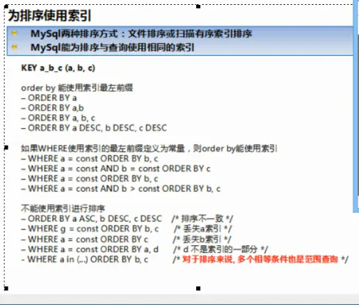

## 数据库查询突然变慢，可能的原因


## 主键选择


## 什么时候触发行锁，什么时候触发间隙所

当select...for updata或update...时

行锁：唯一索引精确查找

间隙锁：非唯一索引精确查找，所有索引范围查找

表锁：无索引可以用

https://zhuanlan.zhihu.com/p/144471126

## select执行过程

(1)FROM <left_table>
(3)　<join_type> JOIN <right_table>
(2)　 ON <join_condition>
(4)WHERE <where_condition>
(5)GROUP BY <group_by_list>
(6)WITH {CUBE | ROLLUP}
(7)HAVING <having_condition>
(8)SELECT
(9)DISTINCT
(10)ORDER BY <order_by_list>
(11)LIMIT

每个步骤产生一个虚拟表，该虚拟表被用作下一个步骤的输入。只有最后一步生成的表返回给调用者。
如果没有某一子句，则跳过相应的步骤。


## 建立索引的原则

1. 索引并非越多越好，大量的索引不仅占用磁盘空间，而且还会影响insert,delete,update等语句的性能，因为当表中的数据更改时索引也会相应的调整和更新
2. **避免对经常更新的表做更多的索引**，并且索引中的列尽可能少；对经常用于查询的字段创建索引，避免添加不必要的索引
3. **数据量少的表尽量不要使用索引（300以下）**，由于数据较少，查询花费的时间可能比遍历索引的时间还要短，索引可能不会产生优化效果
4. 在条件表达式中经常用到不同值较多的列上创建索引，**在不同值很少的列上不要建立索引（如性别）**。
5. 在**频繁进行排序或者分组的列上建立索引**，如果排序的列有多个，可以在这些列上建立联合索引。


# Redis

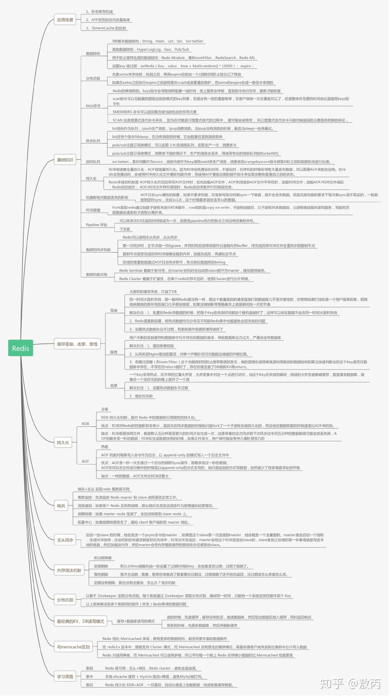

## 为什么快

1. 使用C语言 贴近操作系统
2. Redis将所有数据放在内存中，非数据同步正常工作中，是不需要从磁盘读取数据的
3. Redis使用单线程简化算法的实现，并发的数据结构实现不但困难且测试也麻烦且，单线程避免了线程切换以及加锁释放锁带来的消耗
4. 使用多路复用，自身的事件处理模型将epoll的read、write、close等都转换成事件，不在网络I/O上浪费过多的时间


## 数据预热

缓存预热就是系统启动前,提前将相关的缓存数据直接加载到缓存系统。避免在用户请求的时候,先查询数据库,然后再将数据缓存的问题!用户直接查询实现被预热的缓存数据!

**前置准备工作:**
 1.日常例行统计数据访问记录,统计访问频度较高的热点数据
 2.利用LRU数据删除策略,构建数据留存队列
 **准备工作:**
 3.将统计结果中的数据分类,根据级别,redis优先加载级别较高的热点数据
 4.利用分布式多服务器同时进行数据读取,提速数据加载过程
 **实施:**
 1.使用脚本程序固定出发数据预热过程
 2.如果条件允许,使用了CDN(内容分发网络),效果会更好

## 热Key

所谓热key问题就是，突然有几十万的请求去访问redis上的某个特定key。那么，这样会造成流量过于集中，达到物理网卡上限，从而导致这台redis的服务器宕机。 那接下来这个key的请求，就会直接怼到你的数据库上，导致你的服务不可用。

**备份热点Key**
这个方案说起来其实也很简单，就是不要让key走到一台机器上就行，但是我们知道在Redis集群中包含了`16384`个哈希槽(Hash slot)，集群使用公式`CRC16(key) % 16384`来计算Key属于哪个槽。那么同一个Key计算出来的值应该都是一样的，如何将Key分到其他机器上呢？只要再后面加上随机数就行了，这样就能保证同一个Key分布在不同机器上，在访问的时候通过Key+随机数的方式进行访问。
伪代码如下：

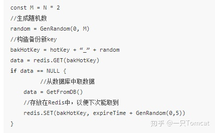


## 分布式锁

```java
	/**
     * 尝试获取分布式锁
     * @param jedis Redis客户端
     * @param lockKey 锁
     * @param requestId 客户端标识
     * @param expireTime 超期时间
     * @return 是否获取成功
     */
//通过requestId解决了分布式下不同客户端时间不统一问题，
//通过超期时间解决了死锁问题
//通过解锁时判断requestId解决了任何客户端都可以解锁问题。

bool tryLock(Redis client, String lockKey, String requestId, int expireTime) {
    String result = client.set(lockKey, requestId, NX, PX, expireTime);        
    if (LOCK_SUCCESS.equals(result)) {            
        return true;
    }        
    return false;
}
void releaseLock(Redis client, String lockKey, String requestId) {   
    //首先获取锁对应的value值，检查是否与requestId相等，如果相等则删除锁（解锁）。
    String script = "\
            if redis.call('get', KEYS[1]) == ARGV[1] \
            then return redis.call('del', KEYS[1]) \
            else return 0 \
            end";
    Object result = jedis.eval(script, lockKey, requestId);        
    if (RELEASE_SUCCESS.equals(result)) {            
        return true;
    }        
    return false;
}

```


## 缓存一致性

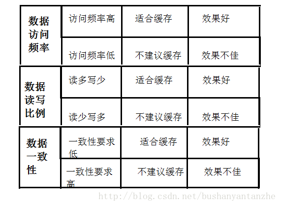

如果项目对缓存的要求是强一致性的，那么就不要使用缓存。我们只能采取合适的策略来降低缓存和数据库间数据不一致的概率，而**无法保证两者间的强一致性**。合适的策略包括合适的缓存更新策略，更新数据库后及时更新缓存、缓存失败时增加重试机制。

**1、第一种方案：采用延时双删策略**

**1.技术整体思路：**

在写库前后都进行redis.del(key)操作，并且设定合理的超时时间。

伪代码如下

```java
public void write(String key,Object data){
    redis.delKey(key);
    db.updateData(data);
    Thread.sleep(500);
    redis.delKey(key);
}
```

**2.具体的步骤就是：**

1）先删除缓存

2）再写数据库

3）休眠500毫秒

4）再次删除缓存

**3.那么，这个500毫秒怎么确定的，具体该休眠多久呢？**

需要评估自己的项目的读数据业务逻辑的耗时。这么做的目的，就是确保读请求结束，写请求可以删除读请求造成的缓存脏数据。

当然这种策略还要考虑redis和数据库主从同步的耗时。最后的的写数据的休眠时间：则在读数据业务逻辑的耗时基础上，加几百ms即可。比如：休眠1秒。

**4.设置缓存过期时间**

从理论上来说，给缓存设置过期时间，是保证最终一致性的解决方案。所有的写操作以数据库为准，只要到达缓存过期时间，则后面的读请求自然会从数据库中读取新值然后回填缓存。

**5.该方案的弊端**

结合双删策略+缓存超时设置，这样最差的情况就是在超时时间内数据存在不一致，而且又增加了写请求的耗时。

**2、第二种方案：异步更新缓存(基于订阅binlog的同步机制)**

**1.技术整体思路：**

MySQL binlog增量订阅消费+消息队列+增量数据更新到redis

**1）读Redis**：热数据基本都在Redis

**2）写MySQL**:增删改都是操作MySQL

**3）更新Redis数据**：MySQ的数据操作binlog，来更新到Redis

**2.Redis更新**

**1）数据操作主要分为两大块：**

- 一个是全量(将全部数据一次写入到redis)
- 一个是增量（实时更新）

这里说的是增量,指的是mysql的update、insert、delate变更数据。

**2）读取binlog后分析 ，利用消息队列,推送更新各台的redis缓存数据。**

这样一旦MySQL中产生了新的写入、更新、删除等操作，就可以把binlog相关的消息推送至Redis，Redis再根据binlog中的记录，对Redis进行更新。

其实这种机制，很类似MySQL的主从备份机制，因为MySQL的主备也是通过binlog来实现的数据一致性。

这里可以结合使用canal(阿里的一款开源框架)，通过该框架可以对MySQL的binlog进行订阅，而canal正是模仿了mysql的slave数据库的备份请求，使得Redis的数据更新达到了相同的效果。

当然，这里的消息推送工具你也可以采用别的第三方：kafka、rabbitMQ等来实现推送更新Redis。

## 缓存雪崩

《吊打面试官》系列-Redis缓存雪崩、击穿、穿透 - 敖丙的文章 - 知乎
https://zhuanlan.zhihu.com/p/89961333

  **描述：**

​      缓存雪崩是指缓存中数据大批量到过期时间，而查询数据量巨大，引起数据库压力过大甚至down机。和缓存击穿不同的是，缓存击穿指并发查同一条数据，缓存雪崩是不同数据都过期了，很多数据都查不到从而查数据库。

**解决方案**：

1. 缓存数据的过期时间设置随机，防止同一时间大量数据过期现象发生。
2. 如果缓存数据库是分布式部署，将热点数据均匀分布在不同搞得缓存数据库中。
3. 设置热点数据永远不过期。

## 缓存击穿

**描述：**

​      缓存击穿是指缓存中没有但数据库中有的数据（一般是缓存时间到期），这时由于并发用户特别多，同时读缓存没读到数据，又同时去数据库去取数据，引起数据库压力瞬间增大，造成过大压力

**解决方案：**

1. 设置热点数据永远不过期。
2. 加互斥锁，互斥锁参考代码如下：

​         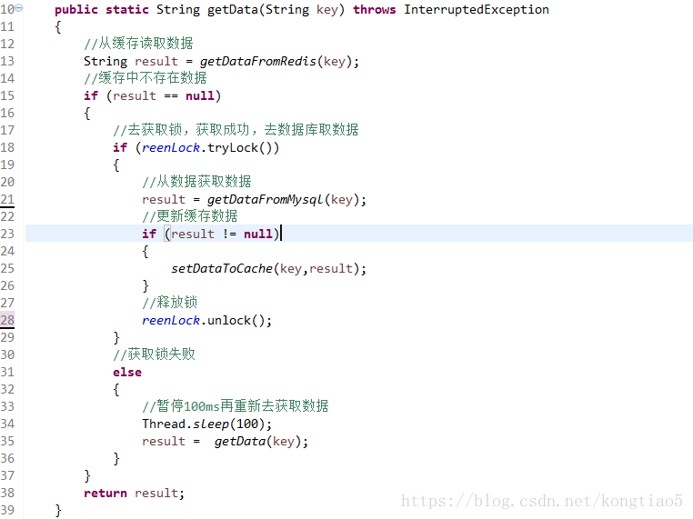 

说明：

1）缓存中有数据，直接走上述代码13行后就返回结果了

2）缓存中没有数据，第1个进入的线程，获取锁并从数据库去取数据，没释放锁之前，其他并行进入的线程会等待100ms，再重新去缓存取数据。这样就防止都去数据库重复取数据，重复往缓存中更新数据情况出现。

3）当然这是简化处理，理论上如果能根据key值加锁就更好了，就是线程A从数据库取key1的数据并不妨碍线程B取key2的数据，上面代码明显做不到这点。

## 缓存穿透

 **描述：**

​       缓存穿透是指缓存和数据库中都没有的数据，而用户不断发起请求，如发起为id为“-1”的数据或id为特别大不存在的数据。这时的用户很可能是攻击者，攻击会导致数据库压力过大。

**解决方案：**

1. 接口层增加校验，如用户鉴权校验，id做基础校验，id<=0的直接拦截；
2. 从缓存取不到的数据，在数据库中也没有取到，这时也可以将key-value对写为key-null，缓存有效时间可以设置短点，如30秒（设置太长会导致正常情况也没法使用）。这样可以防止攻击用户反复用同一个id暴力攻击
3. Redis提供的**布隆过滤器（Bloom Filter）**这个也能很好的预防缓存穿透的发生，他的原理也很简单，就是利用高效的数据结构和算法快速判断出你这个Key是否在数据库中存在，不存在你return就好了，存在你就去查DB刷新KV再return。

## 跳表实现，复杂度

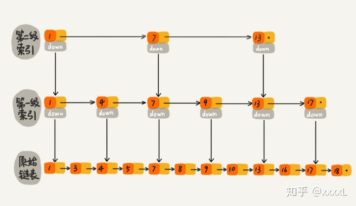

思路是为链表加索引，通过多级索引来进行类似二分查找的操作，插入和删除时需要更新索引，理论插入查询删除的算法时间复杂度为O(logN)。

索引建立方式并不是严格2的指数幂

插入的时候，首先要进行查询，然后从最底层开始，插入被插入的元素。然后看看从下而上，是否需要逐层插入。可是到底要不要插入上一层呢？我们都知道，我们想每层的跳跃都非常高效，越是平衡就越好（第一层1级跳，第二层2级跳，第3层4级跳，第4层8级跳）。但是用算法实现起来，确实非常地复杂的，并且要严格地按照2地指数次幂，我们还要对原有地结构进行调整。所以跳表的思路是**抛硬币，听天由命**，产生一个随机数，**50%概率再向上扩展**，否则就结束。这样子，每一个元素能够有X层的概率为0.5^(X-1)次方。反过来，第X层有多少个元素的数学期望大家也可以算一下。


## rehash

## 持久化是啥

**1. 为什么需要持久化？**

因为Redis是内存数据库，它将自己的数据存储在内存里面，一旦Redis服务器进程退出或者运行Redis服务器的计算机停机，Redis服务器中的数据就会丢失。

为了避免数据丢失，所以Redis提供了持久化机制，将存储在内存中的数据保存到磁盘中，用于在Redis服务器进程退出或者运行Redis服务器的计算机停机导致数据丢失时，快速的恢复之前Redis存储在内存中的数据。

Redis提供了2种持久化方式，分别为：

1. RDB持久化
2. AOF持久化

接下来，我们一一详解。

**2. RDB持久化**

RDB持久化是将某个时间点上Redis中的数据保存到一个RDB文件中，如下所示：


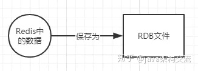


> 基于RDB持久化的上述性质，所以RDB持久化也叫做快照持久化。

该文件是一个经过压缩的二进制文件，通过该文件可以还原生成RDB文件时Redis中的数据，如下所示：


**2.1 创建RDB文件**

Redis提供了2个命令来创建RDB文件，一个是SAVE，另一个是BGSAVE。

SAVE命令会阻塞Redis服务器进程，直到RDB文件创建完毕为止，在服务器进程阻塞期间，服务器不能处理任何命令请求，如下所示：


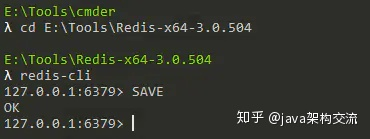


BGSAVE命令会派生出一个子进程，然后由子进程负责创建RDB文件，服务器进程（父进程）继续处理命令请求，如下所示：


以上描述也是这２个命令的区别，**这里是重点，面试经常会问到**。

因为BGSAVE命令可以在不阻塞服务器进程的情况下执行，所以推荐使用BGSAVE命令。

我们可以手动执行该命令，如上面截图所示，但还是推荐设置下Redis服务器配置文件的save选项，让服务器每隔一段时间自动执行一次BGSAVE命令。

我们可以通过save选项设置多个保存条件，只要其中任意一个条件被满足，服务器就会执行BGSAVE命令。

save选项设置的默认条件如下所示：

> save 900 1
> save 300 10
> save 60 10000

默认的配置条件表示，只要满足以下3个条件中的任意1个，BGSAVE命令就会被执行：

- 服务器在900s（即15分钟）之内，对数据库进行了至少1次修改
- 服务器在300s（即5分钟）之内，对数据库进行了至少10次修改
- 服务器在60s（即1分钟）之内，对数据库进行了至少10000次修改

当满足条件执行BGSAVE命令时，输出日志如下图所示：


**2.2 载入RDB文件**

首先，我们要明确的是，载入RDB文件的目的是为了在Redis服务器进程重新启动之后还原之前存储在Redis中的数据。

然后，Redis载入RDB文件并没有专门的命令，而是在Redis服务器启动时自动执行的。

而且，Redis服务器启动时是否会载入RDB文件还取决于服务器是否启用了AOF持久化功能，具体判断逻辑为：

1. 只有在AOF持久化功能处于关闭状态时，服务器才会使用RDB文件来还原数据。
2. 如果服务器开启了AOF持久化功能，那么服务器会优先使用AOF文件来还原数据。

以上判断逻辑如下图所示：


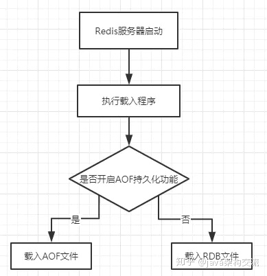


默认情况下，Redis服务器的AOF持久化功能是关闭的，所以Redis服务器在启动时会载入RDB文件，

**2.3 服务器状态**

创建和载入RDB文件，可能存在的服务器状态有以下3种：

1. 当执行SAVE命令时，Redis服务器会被阻塞，此时客户端发送的所有命令请求都会被阻塞，只有在服务器执行完SAVE命令，重新开始接受命令请求之后，客户端发送的命令请求才会被处理。
2. 当执行BGSAVE命令时，Redis服务器不会被阻塞，Redis服务器仍然可以继续处理客户端发送的命令请求。
3. 服务器在载入RDB文件期间，会一直处于阻塞状态，直到RDB文件载入成功。

**3. AOF持久化**

AOF持久化是通过保存Redis服务器所执行的写命令来记录数据库数据的，如下图所示：


默认情况下，AOF持久化功能是关闭的，如果想要打开，可以修改下图所示的配置：


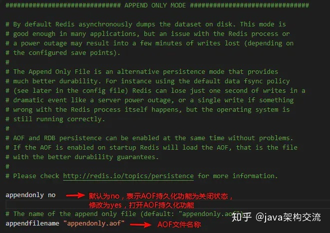


举个例子，假设Redis中还没有存储任何数据，我们执行了如下所示的命令：

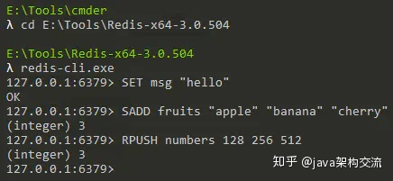


然后我们会发现Redis服务器生成了1个名为appendonly.aof的文件，打开该文件，我们可以看到上面执行的3个写命令都存储在该文件中：


**3.1 AOF持久化的实现**

当AOF持久化功能处于打开状态时，Redis服务器在执行完一个写命令之后，会以协议格式（如上面截图中AOF文件里保存写命令的格式）将被执行的写命令追加到服务器状态的AOF缓冲区的末尾，然后Redis服务器会根据配置文件中appendfsync选项的值来决定何时将AOF缓冲区中的内容写入和同步到AOF文件里面。

appendfsync选项有以下3个值：

1. always
   从安全性来说，always是最安全的（丢失数据最少），因为即使出现故障停机，数据库也只会丢失一个事件循环中所产生的命令数据。
   从效率来说，always的效率最慢，因为服务器在每个事件循环都要将AOF缓冲区中的所有内容写入到AOF文件，并且同步AOF文件。
2. everysec
   从安全性来说，everysec模式下，即使出现故障停机，数据库只会丢失一秒钟的命令数据。
   从效率来说，everysec模式足够快，因为服务器在每个事件循环都要将AOF缓冲区中的所有内容写入到AOF文件，并且每隔一秒就要在子线程中对AOF文件进行同步。
3. no
   从安全性来说，no模式下，如果出现故障停机，数据库会丢失上次同步AOF文件之后的所有写命令数据，具有不确定性，因为服务器在每个事件循环都要将AOF缓冲区中的所有内容写入到AOF文件，至于何时对AOF文件进行同步，则由操作系统控制。
   从效率来说，no模式和everysec模式的效率差不多。

appendfsync选项的默认值是everysec，也推荐使用这个值，因为既保证了效率又保证了安全性。


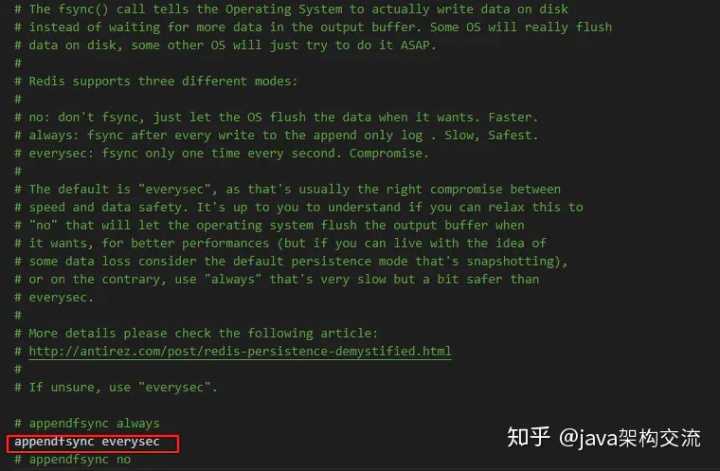


**3.2 载入AOF文件**

因为AOF文件包含了重建数据库所需的所有写命令，所以Redis服务器只要读入并重新执行一遍AOF文件里面保存的写命令，就可以还原Redis服务器关闭之前的数据。

Redis读取AOF文件并还原数据库的详细步骤如下：

1. 创建一个不带网络连接的伪客户端
   因为Redis的命令只能在客户端上下文中执行，而载入AOF文件时所使用的命令直接来源于AOF文件而不是网络连接，所以服务器使用了一个没有网络连接的伪客户端来执行AOF文件保存的写命令。
   伪客户端执行命令的效果和带网络连接的客户端执行命令的效果完全一样。
2. 从AOF文件中分析并读取出一条写命令。
3. 使用伪客户端执行被读取出的写命令。
4. 一直执行步骤2和步骤3，直到AOF文件中的所有写命令都被执行完毕。

以上步骤如下图所示：


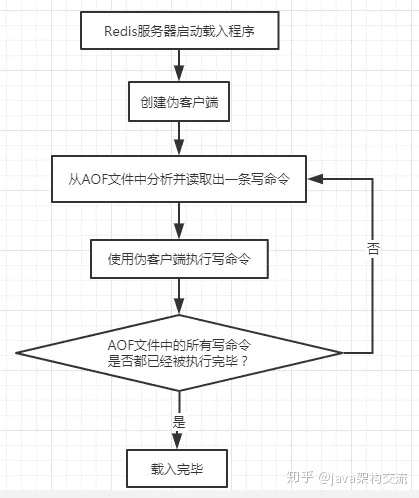


如果Redis服务器开启了AOF持久化功能，那么Redis服务器在启动时会载入AOF文件，

启动日志如下所示：


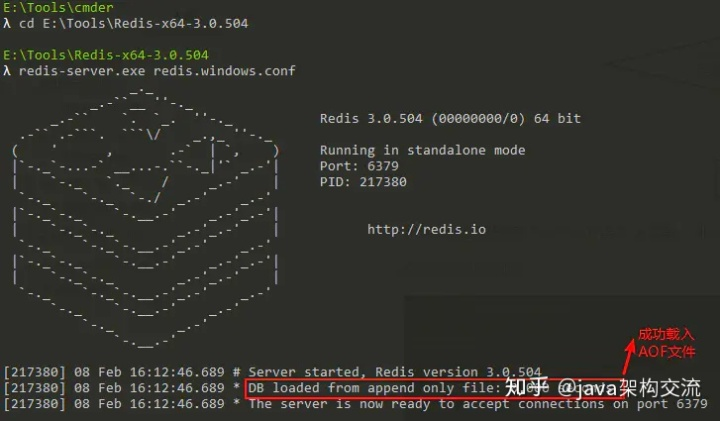

**3.3 AOF重写**

因为AOF持久化是通过保存被执行的写命令来记录数据库数据的，所以随着Redis服务器运行时间的增加，AOF文件中的内容会越来越多，文件的体积会越来越大，如果不做控制，会有以下2点坏处：

1. 过多的占用服务器磁盘空间，可能会对Redis服务器甚至整个宿主计算机造成影响。
2. AOF文件的体积越大，使用AOF文件来进行数据库还原所需的时间就越多。

举个例子，在客户端执行如下命令：


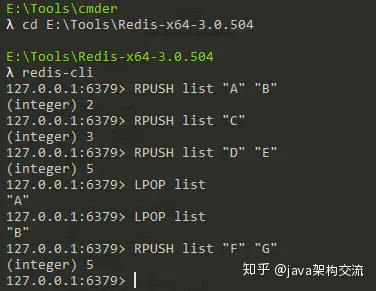


image.png

为了记录这个list键的状态，AOF文件就需要保存上面执行的6条命令。

为了解决AO文件体积越来越大的问题，Redis提供了AOF文件重写功能，即Redis服务器会创建一个新的AOF文件来替代现有的AOF文件，新旧两个AOF文件所保存的数据库数据相同，但新AOF文件不会包含任何浪费空间的冗余命令，所以新AOF文件的体积通常会比旧AOF文件的体积要小很多。

**3.3.1 AOF重写的实现原理**

AOF文件重写并不需要对现有的AOF文件进行任何读取、分析或者写入操作，而是通过读取服务器当前的数据库数据来实现的。

仍然以上面的list键为例，旧的AOF文件保存了6条命令来记录list键的状态，但list键的结果是“C” "D" "E" "F" "G"这样的数据，所以AOF文件重写时，可以用一条`RPUSH list “C” "D" "E" "F" "G"`命令来代替之前的六条命令，这样就可以将保存list键所需的命令从六条减少为一条了。

按照上面的原理，如果Redis服务器存储的键值对足够多，AOF文件重写生成的新AOF文件就会减少很多很多的冗余命令，进而大大减小了AOF文件的体积。

综上所述，**AOF文件重写功能的实现原理为：**

**首先从数据库中读取键现在的值，然后用一条命令去记录键值对，代替之前记录这个键值对的多条命令。**

**3.3.2 AOF后台重写**

因为AOF文件重写会进行大量的文件写入操作，所以执行这个操作的线程将被长时间阻塞。

因为Redis服务器使用单个线程来处理命令请求，所以如果由服务器进程直接执行这个操作，那么在重写AOF文件期间，服务器将无法处理客户端发送过来的命令请求。

为了避免上述问题，Redis将AOF文件重写功能放到子进程里执行，这样做有以下2个好处：

1. 子进程进行AOF文件重写期间，服务器进程（父进程）可以继续处理命令请求。
2. 子进程带有服务器进程的数据副本，使用子进程而不是线程，可以在避免使用锁的情况下，保证数据的安全性。

AOF后台重写的步骤如下所示：

1. 服务器进程创建子进程，子进程开始AOF文件重写
2. 从创建子进程开始，服务器进程执行的所有写命令不仅要写入AOF缓冲区，还要写入AOF重写缓冲区
   写入AOF缓冲区的目的是为了同步到原有的AOF文件。
   写入AOF重写缓冲区的目的是因为子进程在进行AOF文件重写期间，服务器进程还在继续处理命令请求，
   而新的命令可能会对现有的数据库进行修改，从而使得服务器当前的数据库数据和重写后的AOF文件所
   保存的数据库数据不一致。
3. 子进程完成AOF重写工作，向父进程发送一个信号，父进程在接收到该信号后，会执行以下操作：
   1.将AOF重写缓冲区中的所有内容写入到新AOF文件中，这样就保证了新AOF文件所保存的数据库数据和服务器当前的数据库数据是一致的。
   2.对新的AOF文件进行改名，原子地覆盖现有的AOF文件，完成新旧两个AOF文件的替换。

Redis提供了`BGREWRITEAOF`命令来执行以上步骤，如下图所示：


执行完成后，打开appendonly.aof文件，发现保存list键的命令从六条变为了一条：


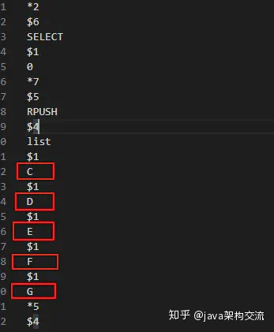


除了手动执行`BGREWRITEAOF`命令外，Redis还提供了2个配置项用来自动执行`BGREWRITEAOF`命令：

> auto-aof-rewrite-percentage 100
> auto-aof-rewrite-min-size 64mb


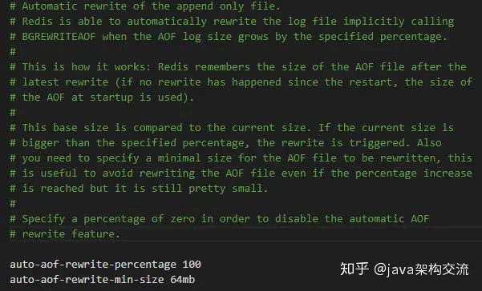


该配置表示，当AOF文件的体积大于64MB，并且AOF文件的体积比上一次重写之后的体积大了至少一倍（100%），Redis将自动执行`BGREWRITEAOF`命令。

**4. RDB持久化、AOF持久化的区别**

通过上面的讲解，我们会发现Redis提供的2种持久化方法是有区别的，可以总结为以下4点：

1. 实现方式
2. 文件体积
3. 安全性
4. 优先级

接下来一一讲解。

**4.1 实现方式**

RDB持久化是通过将某个时间点Redis服务器存储的数据保存到RDB文件中来实现持久化的。

AOF持久化是通过将Redis服务器执行的所有写命令保存到AOF文件中来实现持久化的。

**4.2 文件体积**

由上述实现方式可知，RDB持久化记录的是结果，AOF持久化记录的是过程，所以AOF持久化生成的AOF文件会有体积越来越大的问题，Redis提供了AOF重写功能来减小AOF文件体积。

**4.3 安全性**

AOF持久化的安全性要比RDB持久化的安全性高，即如果发生机器故障，AOF持久化要比RDB持久化丢失的数据要少。

因为RDB持久化会丢失上次RDB持久化后写入的数据，而AOF持久化最多丢失1s之内写入的数据（使用默认everysec配置的话）。

**4.4 优先级**

由于上述的安全性问题，如果Redis服务器开启了AOF持久化功能，Redis服务器在启动时会使用AOF文件来还原数据，如果Redis服务器没有开启AOF持久化功能，Redis服务器在启动时会使用RDB文件来还原数据，所以AOF文件的优先级比RDB文件的优先级高。


## 生产中的持久化方案

在生产上采用的持久化策略为 -

- (1)master关闭持久化
- (2)slave开RDB即可，必要的时候AOF和RDB都开启

### (1)master关闭持久化

原因很简单，因为无论哪种持久化方式都会影响redis的性能，哪一种持久化都会造成CPU卡顿，影响对客户端请求的处理。为了保证读写最佳性能，将master的持久化关闭！ 

*RDB持久化* 

RDB持久化是将当前进程中的数据生成快照保存到硬盘(因此也称作快照持久化)，保存的文件后缀是rdb；当Redis重新启动时，可以读取快照文件恢复数据。 那么RDB持久化的过程，相当于在执行bgsave命令。该命令执行过程如下图所示 


 如图所示，主线程需要调用系统函数fork()，构建出一个子进程进行持久化！很不幸的是，**在构建子进程的过程中，父进程就会阻塞**，无法响应客户端的请求！ 而且，在测试中发现，fork函数在虚拟机上较慢，真机上较快。考虑到现在都是部署在docker容器中，很少部署在真机上，**为了性能，master不建议打开RDB持久化**！

*AOF持久化* 

RDB持久化是将进程数据写入文件，而AOF持久化(即Append Only File持久化)，则是将Redis执行的每次写命令记录到单独的日志文件中。 

随着时间的流逝，你会发现这个AOF文件越来越大，于是redis有一套rewrite机制，来缩小AOF文件的体积。然而，在rewrite的过程中也是需要父进程来fork出一个子进程进行rewrite操作。至于fork函数的影响，上面提到过了。

 还有一个就是刷盘策略fsync，这个值推荐是配everysec,也就是Redis会默认每隔一秒进行一次fsync调用，将缓冲区中的数据写到磁盘。 然而，如果磁盘性能不稳定，fsync的调用时间超过1秒钟。此时主线程进行AOF的时候会对比上次fsync成功的时间；如果距上次不到2s，主线程直接返回；如果超过2s，则主线程阻塞直到fsync同步完成。 因此AOF也是会影响redis的性能的。 

`ps`:linux函数中，wrtie函数将数据写入文件的时候，是将数据写入操作系统的缓冲区，还并未刷入磁盘。而fsync函数，可以强制让操作系统将缓冲区数据刷入磁盘。

综上所述，我们为了保证读写性能最大化，将master的持久化关闭。

### (2)slave开RDB即可，必要的时候AOF和RDB都开启

首先，我先说明一下，我不推荐单开AOF的原因是，**基于AOF的数据恢复太慢**。

 你要想，我们已经做了**主从复制，数据已经实现备份**，为什么slave还需要开持久化?

 因为某一天可能因为某某工程，把机房的电线挖断了，就会导致master和slave机器同时关机。 那么这个时候，我们需要迅速恢复集群，而RDB文件文件小、恢复快，因此灾难恢复常用RDB文件。

其次，官网也不推荐单开AOF，地址如下: 

```
https://redis.io/topics/persistence
```

截图如下 


所以，如果实在对数据安全有一定要求，将AOF和RDB持久化都开启。

另外，做好灾难备份。利用linux的scp命令，定期将rdb文件拷贝到云服务器上。 

`ps`:scp是secure copy的简写，用于在Linux下进行远程拷贝文件的命令，和它类似的命令有cp，不过cp只是在本机进行拷贝不能跨服务器，而且scp传输是加密的。


## 事务

**Redis事务的概念：**

　　Redis 事务的本质是一组命令的集合。事务支持一次执行多个命令，一个事务中所有命令都会被序列化。在事务执行过程，会按照顺序串行化执行队列中的命令，其他客户端提交的命令请求不会插入到事务执行命令序列中。

　　总结说：redis事务就是一次性、顺序性、排他性的执行一个队列中的一系列命令。　　

**Redis事务没有隔离级别的概念：**

　　批量操作在发送 EXEC 命令前被放入队列缓存，并不会被实际执行，也就不存在事务内的查询要看到事务里的更新，事务外查询不能看到。

**Redis不保证原子性：**

　　Redis中，单条命令是原子性执行的，但事务不保证原子性，且没有回滚。事务中任意命令执行失败，其余的命令仍会被执行。

**Redis事务的三个阶段：**

- 开始事务
- 命令入队
- 执行事务

**Redis事务相关命令：**

　　watch key1 key2 ... : 监视一或多个key,如果在事务执行之前，被监视的key被其他命令改动，则事务被打断 （ 类似乐观锁 ）

　　multi : 标记一个事务块的开始（ queued ）

　　exec : 执行所有事务块的命令 （ 一旦执行exec后，之前加的监控锁都会被取消掉 ）　

　　discard : 取消事务，放弃事务块中的所有命令

　　unwatch : 取消watch对所有key的监控

**实现：**

在客户端打开了事务标识后，只有命令：EXEC，DISCARD，WATCH，MULTI命令会被立即执行，其它命令服务器不会立即执行，而是将这些命令放入到一个pipeline里面。当执行EXEC时一次性将所有命令发送给Redis，这样也可以减少Redis和客户端的通信往返次数、提高性能。


## 过期、淘汰


# Go

## interface{}实现

## sync.map实现

## channel实现

```go
type hchan struct {
    qcount   uint           // 缓冲区可容纳大小
    dataqsiz uint           // 缓冲区已有数据大小
    buf      unsafe.Pointer // 缓冲区
    elemsize uint16
    closed   uint32
    elemtype *_type // 元素类型
    sendx    uint   // 待发送goroutine数
    recvx    uint   // 待接收goroutine数
    recvq    waitq  // 等待接收的goroutine
    sendq    waitq  // 等待发送的goroutine

    // lock protects all fields in hchan, as well as several
    // fields in sudogs blocked on this channel.
    //
    // Do not change another G's status while holding this lock
    // (in particular, do not ready a G), as this can deadlock
    // with stack shrinking.
    lock mutex  //为每个读写操作锁定通道，因为发送和接收必须是互斥操作。
}
```

- hchan结构体使**用一个环形队列**来保存groutine之间传递的数据(如果是缓存channel的话)，

- 使用**两个list**保存像该chan发送和从该chan接收数据的goroutine，

- 还有一个mutex来保证操作这些结构的安全。

发送操作概要

1、锁定整个通道结构。

2、确定写入。尝试`recvq`从等待队列中等待goroutine，然后将元素直接写入goroutine。

3、如果recvq为Empty，则确定缓冲区是否可用。如果可用，从当前goroutine复制数据到缓冲区。

4、如果缓冲区已满，**则要**写入的元素将保存在当前正在执行的goroutine的结构中，并且当前goroutine将在**sendq中**排队并从运行时挂起。

5、写入完成释放锁。

读取操作概要

1、先获取channel全局锁

2、尝试sendq从等待队列中获取等待的goroutine，

3、 如有等待的goroutine，没有缓冲区，取出goroutine并读取数据，然后唤醒这个goroutine，结束读取释放锁。

4、如有等待的goroutine，且有缓冲区（此时缓冲区已满），从缓冲区队首取出数据，再从sendq取出一个goroutine，将goroutine中的数据存入buf队尾，结束读取释放锁。

5、如没有等待的goroutine，且缓冲区有数据，直接读取缓冲区数据，结束读取释放锁。

6、如没有等待的goroutine，且没有缓冲区或缓冲区为空，将当前的goroutine加入sendq排队，进入睡眠，等待被写goroutine唤醒。结束读取释放锁。


## gmp实现

## csp

# 算法题

链表排序

二叉树两节点路径


# 大数据

## 十亿个 QQ 号判断一个是否在其中，性能达到 10 万 QPS

## 点赞计数排序top10

# Kafka 

## kafka为什么快

<https://juejin.im/post/6860710388380958734?utm_source=gold_browser_extension>


https://zhuanlan.zhihu.com/p/147054382

1. partition **并行**处理

2. partition**顺序读写**，充分利用磁盘特性，这是基础

3. 采用了**零拷贝**技术 <https://zhuanlan.zhihu.com/p/78335525>

   1. Producer 生产的数据持久化到 broker，采用 mmap 文件映射，实现顺序的快速写入。直接利用操作系统的Page来实现文件到物理内存的直接映射。完成映射之后你对物理内存的操作会被同步到硬盘上（操作系统在适当的时候）。
   2. Customer 从 broker 读取数据，采用 sendfile，将磁盘文件读到OS内核缓冲区后，直接转到socket buffer进行网络发送，减少 CPU 消耗
      

   

## Kafka高可用

kakfa高可用设计 - sky-灯的文章 - 知乎
https://zhuanlan.zhihu.com/p/88185813

将topic分为多个partition，每个partition都有多个副本和自己的leader，分别在不同的broker上


## 如何保证消息传输的可靠性（不会丢消息）

1）消费端弄丢了数据

唯一可能导致消费者弄丢数据的情况，就是说，你那个消费到了这个消息，然后消费者那边自动提交了offset，让kafka以为你已经消费好了这个消息，其实你刚准备处理这个消息，你还没处理，你自己就挂了，此时这条消息就丢咯。

这不是一样么，大家都知道kafka会自动提交offset，那么只要**关闭自动提交offset**，在处理完之后自己手动提交offset，就可以保证数据不会丢。但是此时确实还是会重复消费，比如你刚处理完，还没提交offset，结果自己挂了，**此时肯定会重复消费一次，自己保证幂等性就好了。**

生产环境碰到的一个问题，就是说我们的kafka消费者消费到了数据之后是写到一个内存的queue里先缓冲一下，结果有的时候，你刚把消息写入内存queue，然后消费者会自动提交offset。

然后此时我们重启了系统，就会导致内存queue里还没来得及处理的数据就丢失了

 

 


 

 

2）kafka弄丢了数据

这块比较常见的一个场景，就是kafka某个broker宕机，然后重新选举partiton的leader时。大家想想，要是此时其他的follower刚好还有些数据没有同步，结果此时leader挂了，然后选举某个follower成leader之后，他不就少了一些数据？这就丢了一些数据啊。

生产环境也遇到过，我们也是，之前kafka的leader机器宕机了，将follower切换为leader之后，就会发现说这个数据就丢了

所以此时一般是要求起码设置如下4个参数：

给这个topic设置replication.factor参数：这个值必须大于1，要求每个partition必须有至少2个副本

在kafka服务端设置min.insync.replicas参数：这个值必须大于1，这个是要求一个leader至少感知到有至少一个follower还跟自己保持联系，没掉队，这样才能确保leader挂了还有一个follower吧

在producer端设置**acks=all：这个是要求每条数据，必须是写入所有replica之后，才能认为是写成功了**

在producer端设置retries=MAX（很大很大很大的一个值，无限次重试的意思）：这个是要求一旦写入失败，就无限重试，卡在这里了

我们生产环境就是按照上述要求配置的，这样配置之后，至少在kafka broker端就可以保证在leader所在broker发生故障，进行leader切换时，数据不会丢失


3）生产者会不会弄丢数据

如果按照上述的思路设置了ack=all，一定不会丢，要求是，你的leader接收到消息，所有的follower都同步到了消息之后，才认为本次写成功了。如果没满足这个条件，生产者会自动不断的重试，重试无限次。

## 如何解决重复消费（消息幂等性）

kafka实际上有个offset的概念，就是每个消息写进去，都有一个offset，代表他的序号，然后consumer消费了数据之后，每隔一段时间，会把自己消费过的消息的offset提交一下，代表我已经消费过了，下次我要是重启啥的，你就让我继续从上次消费到的offset来继续消费吧。

但是凡事总有意外，比如我们之前生产经常遇到的，就是你有时候重启系统，看你怎么重启了，如果碰到点着急的，直接kill进程了，再重启。这会导致consumer有些消息处理了，但是没来得及提交offset，尴尬了。重启之后，少数消息会再次消费一次。

其实重复消费不可怕，可怕的是你没考虑到重复消费之后，怎么保证幂等性。

给你举个例子吧。假设你有个系统，消费一条往数据库里插入一条，要是你一个消息重复两次，你不就插入了两条，这数据不就错了？但是你要是消费到第二次的时候，自己判断一下已经消费过了，直接扔了，不就保留了一条数据？

**一条数据重复出现两次，数据库里就只有一条数据，这就保证了系统的幂等性**

幂等性，我通俗点说，就一个数据，或者一个请求，给你重复来多次，你得确保对应的数据是不会改变的，不能出错。

 

 


 

其实还是得结合业务来思考，我这里给几个思路：

（1）比如你拿个数据要写库，你先根据主键查一下，如果这数据都有了，你就别插入了，update一下好吧

（2）比如你是写redis，那没问题了，反正每次都是set，天然幂等性

（3）比如你不是上面两个场景，那做的稍微复杂一点，你需要让生产者发送每条数据的时候，里面加一个全局唯一的id，类似订单id之类的东西，然后你这里消费到了之后，先根据这个id去比如redis里查一下，之前消费过吗？如果没有消费过，你就处理，然后这个id写redis。如果消费过了，那你就别处理了，保证别重复处理相同的消息即可。

还有比如基于数据库的唯一键来保证重复数据不会重复插入多条，我们之前线上系统就有这个问题，就是拿到数据的时候，每次重启可能会有重复，因为kafka消费者还没来得及提交offset，重复数据拿到了以后我们插入的时候，因为有唯一键约束了，所以重复数据只会插入报错，不会导致数据库中出现脏数据

如何保证MQ的消费是幂等性的，需要结合具体的业务来看

 

 


是主要的原理就是**去重** 一般可分为强校验、弱校验

**强校验** 一般与金融相关的操作都是强校验的 （人在996，锅从天上来 偷跑) 比如消费者是一个打款服务，在付款成功后都加一条流水记录。且两个操作放入一个事务中。 再次消费的时候就去流水表查一下有没有这条纪录，如果有表示已经消费过了，直接返回。流水表也能起到对账的作用！ 一些简单的场景也可以依赖数据库唯一约束实现

**弱校验** 这个就没那么严格，重复一下也没那么重要的情况。 可以将ID保存在redis set中，过期时间看情况设置。 如果ID不能保证唯一可以选择生产方生成一个token存入redis，消费方在消费后将其删除（redis的操作能够保证其原子性，删除失败会返回0）


## 如何保证数据的顺序性

首先，**卡夫卡是无法保证全局的消息顺序性的，只能保证主题的某个分区的消息顺序性**。有时候如果刚好需要顺序消息的时候怎么办呢？可以利用这个特点做到消息的局部有序，即将**需要有序的消息都发往同一个分区**，这样就保证了局部有序。

其次，**消费者也需要注意**，如果多个消费者同时消费一个队列。一样可能出现顺序错乱的情况。


 

## MQ积压几百万条数据怎么办？


 

这个是我们真实遇到过的一个场景，确实是线上故障了，这个时候要不然就是修复consumer的问题，让他恢复消费速度，然后傻傻的等待几个小时消费完毕。这个肯定不能在面试的时候说吧。

一个消费者一秒是1000条，一秒3个消费者是3000条，一分钟是18万条，1000多万条

所以如果你积压了几百万到上千万的数据，即使消费者恢复了，也需要大概1小时的时间才能恢复过来

一般这个时候，只能操作临时紧急扩容了，具体操作步骤和思路如下：

1）先修复consumer的问题，确保其恢复消费速度，然后将现有cnosumer都停掉

2）新建一个topic，partition是原来的10倍，临时建立好原先10倍或者20倍的queue数量

3）然后写一个临时的分发数据的consumer程序，这个程序部署上去消费积压的数据，消费之后不做耗时的处理，直接均匀轮询写入临时建立好的10倍数量的queue

4）接着临时征用10倍的机器来部署consumer，每一批consumer消费一个临时queue的数据

5）这种做法相当于是临时将queue资源和consumer资源扩大10倍，以正常的10倍速度来消费数据

6）等快速消费完积压数据之后，得恢复原先部署架构，重新用原先的consumer机器来消费消息

（2）这里我们假设再来第二个坑

假设你用的是rabbitmq，rabbitmq是可以设置过期时间的，就是TTL，如果消息在queue中积压超过一定的时间就会被rabbitmq给清理掉，这个数据就没了。那这就是第二个坑了。这就不是说数据会大量积压在mq里，而是大量的数据会直接搞丢。

这个情况下，就不是说要增加consumer消费积压的消息，因为实际上没啥积压，而是丢了大量的消息。我们可以采取一个方案，就是批量重导，这个我们之前线上也有类似的场景干过。就是大量积压的时候，我们当时就直接丢弃数据了，然后等过了高峰期以后，比如大家一起喝咖啡熬夜到晚上12点以后，用户都睡觉了。

这个时候我们就开始写程序，将丢失的那批数据，写个临时程序，一点一点的查出来，然后重新灌入mq里面去，把白天丢的数据给他补回来。也只能是这样了。

假设1万个订单积压在mq里面，没有处理，其中1000个订单都丢了，你只能手动写程序把那1000个订单给查出来，手动发到mq里去再补一次

 

（3）然后我们再来假设第三个坑

如果走的方式是消息积压在mq里，那么如果你很长时间都没处理掉，此时导致mq都快写满了，咋办？这个还有别的办法吗？没有，谁让你第一个方案执行的太慢了，你临时写程序，接入数据来消费，消费一个丢弃一个，都不要了，快速消费掉所有的消息。然后走第二个方案，到了晚上再补数据吧。