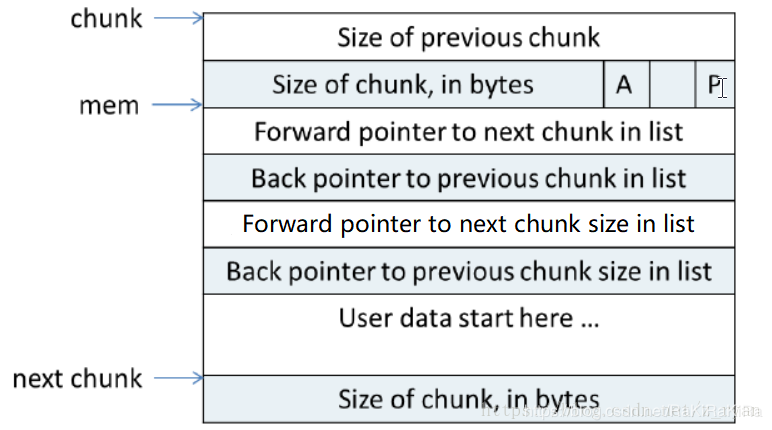
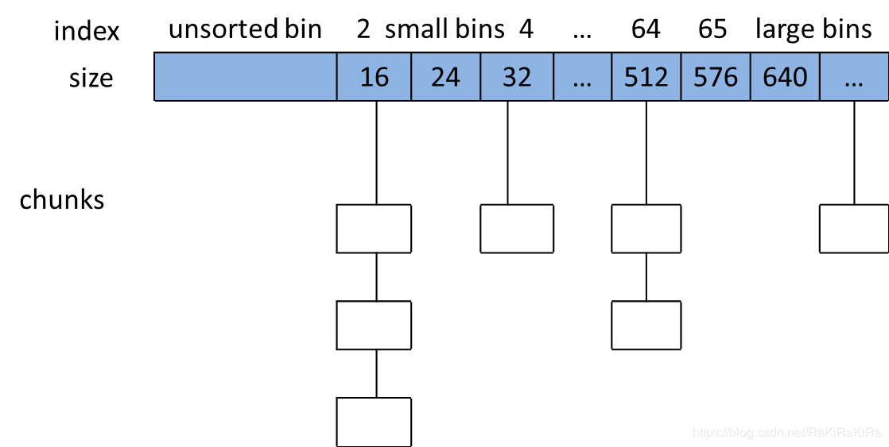
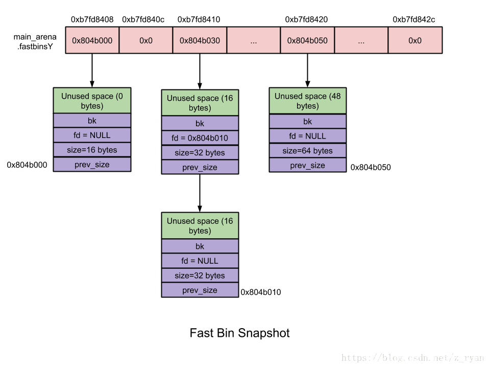
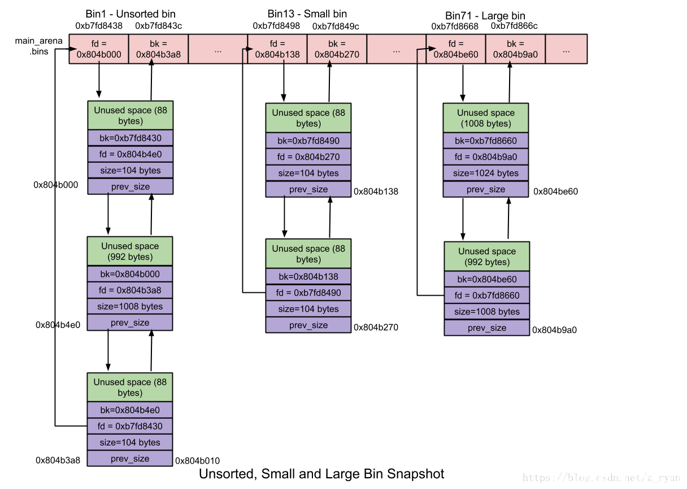
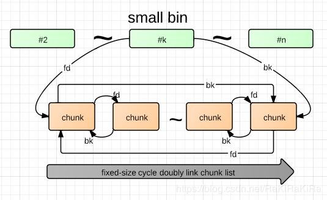

## 前言
本文主要介绍了ptmalloc对于内存分配的管理。结合网上的一些文章和个人的理解，对ptmalloc的实现原理做一些总结。

## 内存布局
介绍ptmalloc之前，我们先了解一下内存布局，以x86的32位系统为例：

从上图可以看到，**栈至顶向下扩展，堆至底向上扩展**， <font color=red>mmap 映射区域至顶向下扩展</font>。 mmap 映射区域和堆相对扩展，直至耗尽虚拟地址空间中的剩余区域，这种结构便于 C 运行时库使用 mmap 映射区域和堆进行内存分配。

## brk（sbrk）和mmap函数
首先，<font color=red>linux系统向用户提供申请的内存有brk(sbrk)和mmap函数</font>。 下面我们先来了解一下这几个函数。

### brk() 和 sbrk()

```cpp
#include <unistd.h>
int brk( const void *addr )
void* sbrk ( intptr_t incr );
```
两者的作用是<font color=red>扩展heap的上界brk</font>
<font color=blue>brk（）的参数设置为新的brk上界地址，成功返回1，失败返回0；</font>
<font color=blue>sbrk（）的参数为申请内存的大小，返回heap新的上界brk的地址</font>

### mmap()
```cpp
#include <sys/mman.h>
void *mmap(void *addr, size\_t length, int prot, int flags, int fd, off\_t offset);
int munmap(void *addr, size_t length);
```
mmap的第一种用法是映射此盘文件到内存中；第二种用法是匿名映射，<font color=red>**不映射磁盘文件，而向映射区申请一块内存**</font>。
**malloc使用的是mmap的第二种用法（匿名映射）。**
Munmap函数用于释放内存。

## 主分配区和非主分配区(可以不看)
Allocate的内存分配器中，为了**解决多线程锁争夺问题**，分为主分配区main_area和非主分配区no_main_area。
　1. 主分配区和非主分配区形成一个环形链表进行管理。
　2. 每一个分配区利用互斥锁使线程对于该分配区的访问互斥。
　3. 每个进程只有一个主分配区，也可以允许有多个非主分配区。
　4. ptmalloc根据系统对分配区的争用动态增加分配区的大小，分配区的数量一旦增加，则不会减少。
　5. 主分配区可以使用brk和mmap来分配，而非主分配区只能使用mmap来映射内存块
　6. 申请小内存时会产生很多内存碎片，ptmalloc在整理时也需要对分配区做加锁操作。

当一个线程需要使用malloc分配内存的时候，会先查看该线程的私有变量中是否已经存在一个分配区。若是存在。会尝试对其进行加锁操作。若是加锁成功，就在使用该分配区分配内存，若是失败，就会遍历循环链表中获取一个未加锁的分配区。若是整个链表中都没有未加锁的分配区，则malloc会开辟一个新的分配区，将其加入全局的循环链表并加锁，然后使用该分配区进行内存分配。当释放这块内存时，同样会先获取待释放内存块所在的分配区的锁。若是有其他线程正在使用该分配区，则必须等待其他线程释放该分配区互斥锁之后才能进行释放内存的操作。

## Malloc实现原理： 
　　因为brk、sbrk、mmap都属于系统调用，若每次申请内存，都调用这三个，那么每次都会产生系统调用，影响性能；其次，这样申请的内存容易产生碎片，因为堆是从低地址到高地址，如果高地址的内存没有被释放，低地址的内存就不能被回收。

所以<font color = red>**malloc采用的是内存池的管理方式**</font>（ptmalloc），ptmalloc<font color = red> **采用边界标记法**</font>将内存划分成很多块，从而对内存的分配与回收进行管理。为了内存分配函数malloc的高效性，**ptmalloc会预先向操作系统申请一块内存供用户使用**，当我们申请和释放内存的时候，ptmalloc会将这些内存管理起来，并通过一些策略来判断是否将其回收给操作系统。这样做的最大好处就是，<font color = blue>**使用户申请和释放内存的时候更加高效，避免产生过多的内存碎片**</font>。

## ptmalloc介绍
ptmalloc 实现了 malloc()，free()以及一组其它的函数。以**提供动态内存管理**的支持。分配器处在用户程序和内核之间，它响应用户的分配请求，向操作系统申请内存，然后将其返回给用户程序，为了保持高效的分配，分配器一般都会预先分配一块大于用户请求的内存，并通过某种算法管理这块内存，来满足用户的内存分配要求，<font color = red>**用户释放掉的内存也并不是立即就返回给操作系统，相反，分配器会管理这些被释放掉的空闲空间，以应对用户以后的内存分配要求**。</font>

也就是说，**分配器不但要管理已分配的内存块，还需要管理空闲的内存块**，当响应用户分配要求时，分配器会首先在空闲空间中寻找一块合适的内存给用户，<font color = red>**在空闲空间中找不到的情况下才分配一块新的内存**</font>。为实现一个高效的分配器，需要考虑很多的因素。比如，分配器本身管理内存块所占用的内存空间必须很小，分配算法必须要足够的快。


### chunk 内存块的基本组织单元
<font color = red>用户请求分配的空间在 ptmalloc 中都使用一个 chunk 来表示，用户调用 free()函数释放掉的内存也并不是立即就归还给操作系统，相反，它们也会被表示为一个 chunk</font>，ptmalloc 使用特定的数据结构来管理这些空闲的 chunk。
ptmalloc **在给用户分配的空间的前后加上了一些控制信息**用于描述这些块。
在 ptmalloc 的实现源码中定义结构体 malloc_chunk 来描述这些块。malloc_chunk 定义如下：

```cpp
struct malloc_chunk {  
  INTERNAL_SIZE_T      prev_size;    /* Size of previous chunk (if free).  */  
  INTERNAL_SIZE_T      size;         /* Size in bytes, including overhead. */  
  
  struct malloc_chunk* fd;           /* double links -- used only if free. */  
  struct malloc_chunk* bk;  
  
  /* Only used for large blocks: pointer to next larger size.  */  
  struct malloc_chunk* fd_nextsize;      /* double links -- used only if free. */  
  struct malloc_chunk* bk_nextsize; 
};  

```
chunk 的定义相当简单明了，对各个域做一下简单介绍 :
　　**prev_size**: 如果前一个 chunk 是空闲的，该域表示前一个 chunk 的大小，如果前一个 chunk 不空闲，该域无意义。
　　**size** ：当前 chunk 的大小，并且记录了当前 chunk 和前一个 chunk 的一些属性，包括前一个 chunk 是否在使用中，当前 chunk 是否是通过 mmap 获得的内存，当前 chunk 是否属于非主分配区。
　　 **fd 和 bk** ： 指针 fd 和 bk 只有当该 chunk 块空闲时才存在，其作用是用于将对应的空闲 chunk 块加入到空闲chunk 块链表中统一管理，如果该 chunk 块被分配给应用程序使用，那么这两个指针也就没有用（该 chunk 块已经从空闲链中拆出）了，所以也当作应用程序的使用空间，而不至于浪费。
　　**fd_nextsize 和 bk_nextsize**: 当当前的 chunk 存在于 large bins 中时， large bins 中的空闲 chunk 是按照大小排序的，但同一个大小的 chunk 可能有多个，增加了这两个字段可以加快遍历空闲 chunk ，并查找满足需要的空闲 chunk ， fd_nextsize 指向下一个比当前 chunk 大小大的第一个空闲 chunk ， bk_nextszie 指向前一个比当前 chunk 大小小的第一个空闲 chunk 。 如果该 chunk 块被分配给应用程序使用，那么这两个指针也就没有用（该chunk 块已经从 size 链中拆出）了，所以也当作应用程序的使用空间，而不至于浪费。

### chunk的结构
chunk的结构可以分为使用中的chunk和空闲的chunk。使用中的chunk和空闲的chunk数据结构基本项同，但是会有一些设计上的小技巧，巧妙的节省了内存。

### 使用中的chunk：


说明：
　　1、 **chunk指针指向chunk开始的地址；mem指针指向用户内存块开始的地址。**
　　2、 p=0时，表示前一个chunk为空闲，prev_size才有效
　　3、p=1时，表示前一个chunk正在使用，prev_size无效 p主要用于内存块的合并操作；ptmalloc 分配的第一个块总是将p设为1, 以防止程序引用到不存在的区域
　　4、M=1 为mmap映射区域分配；M=0为heap区域分配
　　5、 A=0 为主分配区分配；A=1 为非主分配区分配。

### 空闲的chunk：


说明：

 1. 当chunk**空闲时，其M状态是不存在的，只有AP状态**，
 2. 原本是用户数据区的地方存储了四个指针，
	- 指针fd指向后一个空闲的chunk,而bk指向前一个空闲的chunk，**malloc通过这两个指针将大小相近的chunk连成一个双向链表**。
	 - 在large bin中的空闲chunk，还有两个指针，fd_nextsize和bk_nextsize，用于**加快在large bin中查找最近匹配的空闲chunk**。不同的chunk链表又是通过bins或者fastbins来组织的。


### 空闲链表bins
当用户使用free函数释放掉的内存，ptmalloc并不会马上交还给操作系统，而是被ptmalloc本身的空闲链表bins管理起来了，当用户进行下一次分配请求时，ptmalloc就会**从空闲的bins上寻找一块合适大小的内存块分配给用户使用**。这样的好处<font color = red>**可以避免频繁的系统调用，降低内存分配的开销**</font>。
　　**malloc将相似大小的chunk用双向链表链接起来，这样一个链表被称为一个bin**。
　　ptmalloc一共维护了128bin。每个bins都维护了大小相近的双向链表的chunk。基于chunk的大小，有下列几种可用bins：
　　1、Fast bin
　　2、Unsorted bin
　　3、Small bin
　　4、Large bin
　　
　　保存这些bin的数据结构为：
　　fastbinsY：这个数组用以保存fast bins。
　　bins：这个数组用以保存unsorted、small以及large bins，共计可容纳126个：

　　当用户调用malloc的时候，能很快找到用户需要分配的内存大小是否在维护的bin上，如果在某一个bin上，就可以通过双向链表去查找合适的chunk内存块给用户使用。

bins数组中的第一个为 unsorted bin.
数组中从 2 开始编号的**前 64 个 bin 称为 small bins**，<font color = green>**同一个small bin中的chunk具有相同的大小。两个相邻的small bin中的chunk大小相差8bytes。**</font>small bins 中的 chunk 按照最近使用顺序进行排列（FIFO），最后释放的 chunk 被链接到链表的头部，而申请 chunk 是从链表尾部开始，这样，每一个 chunk 都有相同的机会被 ptmalloc 选中。

Small bins 后面的 bin 被称作 large bins。**large bins 中的每一个 bin 分别包含了一个给定范围内的 chunk**，其中的 chunk 按大小序排列。相同大小的 chunk 同样按照最近使用顺序排列。

ptmalloc 使用<font color = red>**smallest-first，best-fit（以最小块优先，最佳适合）**</font>原则在空闲 large bins 中查找合适的 chunk。

当空闲的 chunk 被链接到 bin 中的时候，ptmalloc 会把表示该 chunk 是否处于使用中的标志 P 设为 0（注意，这个标志实际上处在下一个 chunk 中），同时 ptmalloc 还会检查它前后的 chunk 是否也是空闲的，如果是的话，**ptmalloc 会首先把它们合并为一个大的 chunk，然后将合并后的 chunk 放到 unstored bin 中。**

要注意的是，并不是所有的 chunk 被释放后就立即被放到 bin 中。<font color = red>**ptmalloc 为了提高分配的速度，会把一些小的的 chunk 先放到一个叫做fast bins 的容器内。**</font>

#### 1. fast bins。

　　程序在运行时会经常需要申请和释放一些较小的内存空间。当分配器合并了相邻的几个小的 chunk 之后,也许马上就会有另一个小块内存的请求,这样分配器又需要从大的空闲内存中切分出一块,这样无疑是比较低效的,故而,<font color = red>**malloc 中在分配过程中引入了 fast bins,不大于 max_fast （默认值为 64B）的 chunk 被释放后，首先会被放到 fast bins 中，fast bins 中的 chunk 并不改变它的使用标志 P。**</font>这样也就无法将它们合并。
　　
　　fast bins是bins的高速缓冲区，大约有10个定长队列。每个fast bin都记录着一条free chunk的单链表（称为binlist ，采用单链表是出于fast bin中链表中部的chunk不会被摘除的特点），增删chunk都发生在链表的前端。 fast bins 记录着大小以8字节递增的bin链表。
　　当用户释放一块不大于max_fast（默认值64B）的chunk的时候，会默认会被放到fast bins上。<font color = red>**当需要给用户分配的 chunk 小于或等于 max_fast 时,malloc 首先会到fast bins上寻找是否有合适的chunk，**</font>
　　除非特定情况，两个毗连的空闲chunk并不会被合并成一个空闲chunk。不合并可能会导致碎片化问题，但是却可以大大加速释放的过程！
　　分配时，binlist中被检索的第一个个chunk将被摘除并返回给用户。free掉的chunk将被添加在索引到的binlist的前端。
　　

#### 2. unsorted bin。
　　**unsorted bin 的队列使用 bins 数组的第一个位置**，是bins的一个缓冲区，加快分配的速度。<font color=red>**当用户释放的内存大于max_fast或者fast bins合并后的chunk都会首先进入unsorted bin上。**</font>
　　<font color=blue>**在进行 malloc 操作的时候，如果在 fast bins 中没有找到合适的 chunk，则 ptmalloc 会先在 unsorted bin 中查找合适的空闲 chunk，如果没有合适的bin，ptmalloc会将unsorted bin上的chunk放入bins上，然后才查找 bins。**</font>
　　<font color=green>**unsorted bin 可以看做是 bins 的一个缓冲区，增加它只是为了加快分配的速度。**</font>
**具体遍历过程如下**：
1. 如果 unsorted bins 上只有一个chunk并且大于待分配的chunk，则进行切割，并且剩余的chunk继续扔回 unsorted bins
2. 如果unsorted bins上有大小和待分配chunk相等的，则返回，并从unsorted bins删除；
3. 如果unsorted bins中的某一chunk大小 属于small bins的范围，则放入small bins的头部；
4. 如果unsorted bins中的某一chunk大小 属于large bins的范围，则找到合适的位置放入。

　　chunk大小 – 无尺寸限制，任何大小chunk都可以添加进这里。这种途径给予 ‘glibc malloc’ 第二次机会以重新使用最近free掉的chunk，这样寻找合适bin的时间开销就被抹掉了，因此内存的分配和释放会更快一些。


#### 3. small bins
　　**大小<512字节的chunk被称为small chunk**，而保存small chunks的bin被称为small bin。
　　**数组从2开始编号，前64个bin为small bins**，<font color=red>**small bin每个bin之间相差8个字节，同一个small bin中的chunk具有相同大小。**</font>
　　每个small bin都包括一个空闲区块的双向循环链表（也称binlist）。<font color=green>**free掉的chunk添加在链表的前端，而所需chunk则从链表后端摘除。**</font>
　　<font color=blue>**两个毗连的空闲chunk会被合并成一个空闲chunk。合并消除了碎片化的影响但是减慢了free的速度。**</font>
　　分配时，当small bin非空后，相应的bin会摘除binlist中最后一个chunk并返回给用户。<font color=red>>在free一个chunk的时候，检查(虚拟地址上连续的)其前或其后的chunk是否空闲，若是则合并，也即把它们从所属的链表中摘除并合并成一个新的chunk，新chunk会添加在unsorted bin链表的前端。</font>
　　

#### 4.large bins
　　**大小大于等于512字节的chunk被称为large chunk**，而保存large chunks的bin被称为large bin**（第65~第128）**，位于small bins后面。large bins中的每一个bin分别包含了一个给定范围内的chunk，<font color=red>**其中的chunk按大小递减排序，大小相同则按照最近使用时间排列。**</font>
　　
　　<font color=green>**分配时，遵循原则“smallest-first , best-fit”,从顶部遍历到底部以找到一个大小最接近用户需求的chunk。一旦找到，相应chunk就会分成两块，User chunk（用户请求大小）返回给用户，Remainder chunk（剩余大小）添加到unsorted bin。**</font>
　　
　　free时和small bin 类似。<font color=blue>**两个毗连的空闲chunk会被合并成一个空闲chunk。**</font>


## 例外
***并不是所有chunk都按照上面的方式来组织，有三种列外情况。top chunk，mmaped chunk 和last remainder chunk***
### 　1. Top chunk
　　<font color=red>**top chunk相当于分配区的顶部空闲内存，当bins上都不能满足内存分配要求的时候，就会来top chunk上分配。**</font>
　　当top chunk大小比用户所请求大小还大的时候，top chunk会分为两个部分：User chunk（用户请求大小）和Remainder chunk（剩余大小）。其中Remainder chunk成为新的top chunk。
　　当top chunk大小小于用户所请求的大小时，top chunk就通过sbrk（main arena）或mmap（thread arena）系统调用来扩容。
### 　　2. mmaped chunk
　　当分配的内存非常大（大于分配阀值，默认128K）的时候，需要被mmap映射，则会放到mmaped chunk上，
　　<font color=red>**当释放mmaped chunk上的内存的时候会直接交还给操作系统。**</font>
### 　　3、Last remainder chunk
　　Last remainder chunk是另外一种特殊的chunk，就像top chunk和mmaped chunk一样，不会在任何bins中找到这种chunk。
　　当需要分配一个small chunk,但在small bins中找不到合适的chunk，如果last remainder chunk的大小大于所需要的small chunk大小，last remainder chunk被分裂成两个chunk，其中一个chunk返回给用户，另一个chunk变成新的last remainder chunk。


## sbrk与mmap
　　在堆区中， start_brk 指向 heap 的开始，而 brk 指向 heap 的顶部。可以使用系统调用 brk()和 sbrk()来增 加标识 heap 顶部的 brk 值，从而线性的增加分配给用户的 heap 空间。<font color=red>**在使 malloc 之前，brk 的值等于 start_brk，也就是说 heap 大小为 0。**</font>
　　ptmalloc 在开始时，若请求的空间小于 mmap 分配阈值（mmap threshold，默认值为 128KB）时，主分配区会调用 sbrk()增加一块大小为 (128 KB + chunk_size) align 4KB 的空间作为 heap。非主分配区会调用 mmap 映射一块大小为 HEAP_MAX_SIZE（32 位系统上默认为 1MB，64 位系统上默认为 64MB）的空间作为 sub-heap。这就是前面所说的 ptmalloc 所维护的分配空间;　　　
　　**当用户请求内存分配时，首先会在这个区域内找一块合适的 chunk 给用户。当用户释放了 heap 中的 chunk 时，ptmalloc 又会使用 fastbins 和 bins 来组织空闲 chunk。以备用户的下一次分配。**
　　若需要分配的 chunk 大小小于 mmap分配阈值，而 heap 空间又不够，则此时主分配区会通过 sbrk()调用来增加 heap 大小，非主分配区会调用 mmap 映射一块新的 sub-heap，也就是增加 top chunk 的大小，<font color=green>**每次 heap 增加的值都会对齐到 4KB。**</font>
　　当用户的请求超过 mmap 分配阈值，并且主分配区使用 sbrk()分配失败的时候，或是非主分配区在 top chunk 中不能分配到需要的内存时，ptmalloc 会尝试使用 mmap()直接映射一块内存到进程内存空间。<font color=blue>**使用 mmap()直接映射的 chunk 在释放时直接解除映射，而不再属于进程的内存空间。任何对该内存的访问都会产生段错误。**</font>而在 heap 中或是 sub-heap 中分配的空间则可能会留在进程内存空间内，还可以再次引用（当然是很危险的）。
　　

## 内存分配malloc流程
**free() 函数接受一个指向分配区域的指针作为参数，释放该指针所指向的 chunk。**
而具体的释放方法则根据该 chunk 所处的位置和该 chunk 的大小而定。
 1. 获取分配区的锁，防止多线程冲突。
 1. 计算出实际需要分配的内存的chunk实际大小。
 1. 判断chunk的大小，如果小于max_fast（64Ｂ），则尝试去fast bins上取适合的chunk，如果有则分配结束。否则，下一步；
 1. 判断chunk大小是否小于512B，如果是，则从small bins上去查找chunk，如果有合适的，则分配结束。否则下一步；
 1. ptmalloc首先会遍历fast bins中的chunk，将相邻的chunk进行合并，并链接到unsorted bin中然后遍历 unsorted bins。如果unsorted bins上只有一个chunk并且大于待分配的chunk，则进行切割，并且剩余的chunk继续扔回unsorted bins；如果unsorted bins上有大小和待分配chunk相等的，则返回，并从unsorted bins删除；如果unsorted bins中的某一chunk大小 属于small bins的范围，则放入small bins的头部；如果unsorted bins中的某一chunk大小 属于large bins的范围，则找到合适的位置放入。若未分配成功，转入下一步；
 1. 从large bins中查找找到合适的chunk之后，然后进行切割，一部分分配给用户，剩下的放入unsorted bin中。
 1. 如果搜索fast bins和bins都没有找到合适的chunk，那么就需要操作top chunk来进行分配了
当top chunk大小比用户所请求大小还大的时候，top chunk会分为两个部分：User chunk（用户请求大小）和Remainder chunk（剩余大小）。其中Remainder chunk成为新的top chunk。
　　当top chunk大小小于用户所请求的大小时，top chunk就通过sbrk（main arena）或mmap（thread arena）系统调用来扩容。
 1. 到了这一步，说明 top chunk 也不能满足分配要求，所以，于是就有了两个选择: 如 果是主分配区，调用 sbrk()，增加 top chunk 大小；如果是非主分配区，调用 mmap 来分配一个新的 sub-heap，增加 top chunk 大小；或者使用 mmap()来直接分配。在 这里，需要依靠 chunk 的大小来决定到底使用哪种方法。判断所需分配的 chunk 大小是否大于等于 mmap 分配阈值，如果是的话，则转下一步，调用 mmap 分配， 否则跳到第 10 步，增加 top chunk 的大小。
 1. 使用 mmap 系统调用为程序的内存空间映射一块 chunk_size align 4kB 大小的空间。 然后将内存指针返回给用户。
 1. 判断是否为第一次调用 malloc，若是主分配区，则需要进行一次初始化工作，分配 一块大小为(chunk_size + 128KB) align 4KB 大小的空间作为初始的 heap。若已经初 始化过了，主分配区则调用 sbrk()增加 heap 空间，分主分配区则在 top chunk 中切 割出一个 chunk，使之满足分配需求，并将内存指针返回给用户。

简而言之：<font color=red> **获取分配区(arena)并加锁–> fast bin –> unsorted bin –> small bin –> large bin –> top chunk –> 扩展堆**</font>

## 内存回收流程
 1. 获取分配区的锁，保证线程安全。
 1. 如果free的是空指针，则返回，什么都不做。
 1. 判断当前chunk是否是mmap映射区域映射的内存，如果是，则直接munmap()释放这块内存。前面的已使用chunk的数据结构中，我们可以看到有M来标识是否是mmap映射的内存。
 1. 判断chunk是否与top chunk相邻，如果相邻，则直接和top chunk合并（和top chunk相邻相当于和分配区中的空闲内存块相邻）。转到步骤8
 1. 如果chunk的大小大于max_fast（64b），则放入unsorted bin，并且检查是否有合并，有合并情况并且和top chunk相邻，则转到步骤8；没有合并情况则free。
 1. 如果chunk的大小小于 max_fast（64b），则直接放入fast bin，fast bin并没有改变chunk的状态。没有合并情况，则free；有合并情况，转到步骤7
 1. 在fast bin，如果当前chunk的下一个chunk也是空闲的，则将这两个chunk合并，放入unsorted bin上面。合并后的大小如果大于64B，会触发进行fast bins的合并操作，fast bins中的chunk将被遍历，并与相邻的空闲chunk进行合并，合并后的chunk会被放到unsorted bin中，fast bin会变为空。合并后的chunk和topchunk相邻，则会合并到topchunk中。转到步骤8
 1. 判断top chunk的大小是否大于mmap收缩阈值（默认为128KB），如果是的话，对于主分配区，则会试图归还top chunk中的一部分给操作系统。free结束。

## 使用注意事项
为了避免Glibc内存暴增，需要注意：
　　1. **后分配的内存先释放**，因为ptmalloc收缩内存是从top chunk开始，如果与top chunk相邻的chunk不能释放，top chunk以下的chunk都无法释放。
　　2. **Ptmalloc不适合用于管理长生命周期的内存**，特别是持续不定期分配和释放长生命周期的内存，这将导致ptmalloc内存暴增。
　　3. **不要关闭 ptmalloc 的 mmap 分配阈值动态调整机制**，因为这种机制保证了短生命周期的 内存分配尽量从 ptmalloc 缓存的内存 chunk 中分配，更高效，浪费更少的内存。
　　4. **多线程分阶段执行的程序不适合用ptmalloc，这种程序的内存更适合用内存池管理**
　　5. **尽量减少程序的线程数量和避免频繁分配/释放内存。**频繁分配，会导致锁的竞争，最终导致非主分配区增加，内存碎片增高，并且性能降低。
　　6. **防止内存泄露**，ptmalloc对内存泄露是相当敏感的，根据它的内存收缩机制，如果与top chunk相邻的那个chunk没有回收，将导致top chunk一下很多的空闲内存都无法返回给操作系统。
　　7. **防止程序分配过多的内存，或是由于glibc内存暴增，导致系统内存耗尽，程序因为OOM被系统杀掉**。预估程序可以使用的最大物理内存的大小，配置系统的/proc/sys/vm/overcommit_memory ,/proc/sys/vm/overcommit_ratio,以及使用ulimit -v限制程序能使用的虚拟内存的大小，防止程序因OOM被杀死掉。

