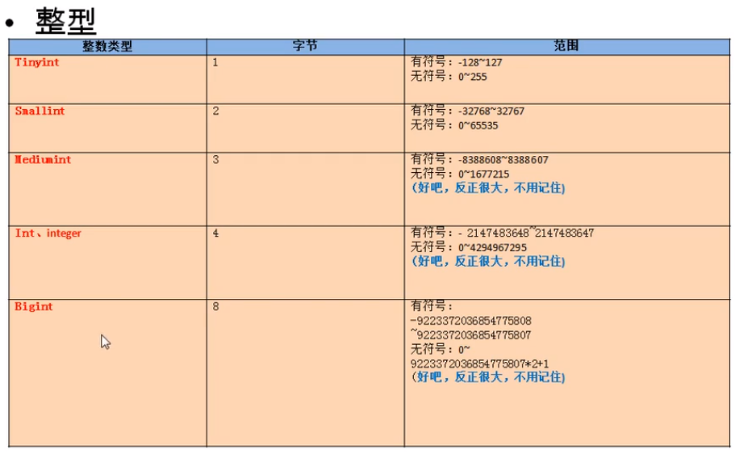
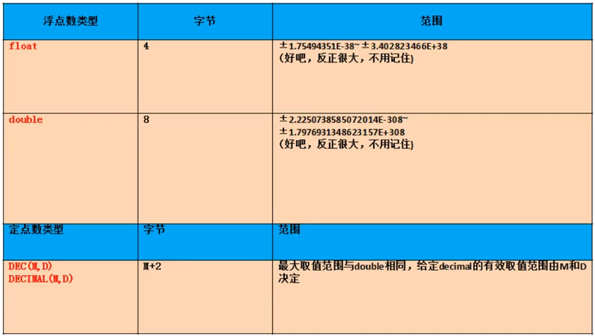

##  库的管理

### 库的创建

```mysql
CREATE DATABASE [IF NOT EXISTS] 库名;
```


### 库的修改（不安全）

```mysql
RENAME DATABASE 旧库名 TO 新库名;	 	      // 改库名
ALTER DATABASE 库名 CHARACTER SET 字符集名; // 改字符集
```


### 库的删除

```mysql
DROP DATABASE 库名;
```


## 表的管理

### 显示表信息

```mysql
DESC 表名;
```


### 表的创建

```mysql
CREATE TABLE 表明（
	列明 列的类型[(长度）] [约束]，
	列明 列的类型[(长度）] [约束]，
    ...
	列明 列的类型[(长度）] [约束]
）;
```


### 表的修改

```mysql
ALTER TABLE 表名 ADD/DROP/MODIFY/CHANGE COLUMN 列名 列类型 【约束】;
```


① 修改列名

```mysql
ALTER TABLE 表名 CHANGE COLUMN 旧列名 新列明 列类型;
```


②修改列类型或约束

```mysql
ALTER TABLE 表名 MODIFY COLUMN 列名 新类型;
```


③添加列

```mysql
ALTER TABLE 表名 ADD COLUMN [IF NOT EXISTS] 列名 类型;
```


④删除列

```mysql
ALTER TABLE 表名 DROP COLUMN [IF EXISTS] 列名;
```


⑤修改表名

```MYSQL
ALTER TABLE 旧表名 RENAME TO 新表名;
```

### 表的删除

```MYSQL
DROP TABLE [IF EXISTS] 表名;
```

### 表的复制

①仅复制库结构

```mysql
CREATE TABLE 新表 LIKE 旧表;
```

②复制表结构+数据

```mysql
CREATE TABLE 新表;
SELECT * FROM 旧表;
```

③只复制部分数据/部分列

```mysql
CREATE TABLE 新表；
SELECT 部分列
FROM 旧表
WHERE 部分数据的约束条件;
```

④只复制部分结构，不复制数据

```mysql
CREATE TABLE 新表；
SELECT 部分列
FROM 旧表
WHERE 0；
```


## 数据类型

### 数值型

#### 整型



​	创建时再后面加上`UNSIGNED`表示无符号，否则有符号。

​	若插入一个超出范围的值，会报异常，5.7之前还会插入临界值。

​	(长度)表示显示的最大宽度

#### 小数： 



M为整数部分+小数部分长度

D为小数部分长度

可以省略，如果超过分为则插入临界值

#### 1 浮点型

默认不限制

float(M, D)

double(M, D)

#### 2 定点型

默认(10, 0)， 精确度比浮点型高一些

dec(M, D)

decimal(M, D)

### 字符型

​	较短文本： char, varchar

​	较长文本： test（较长的二进制数据）

### 日期型